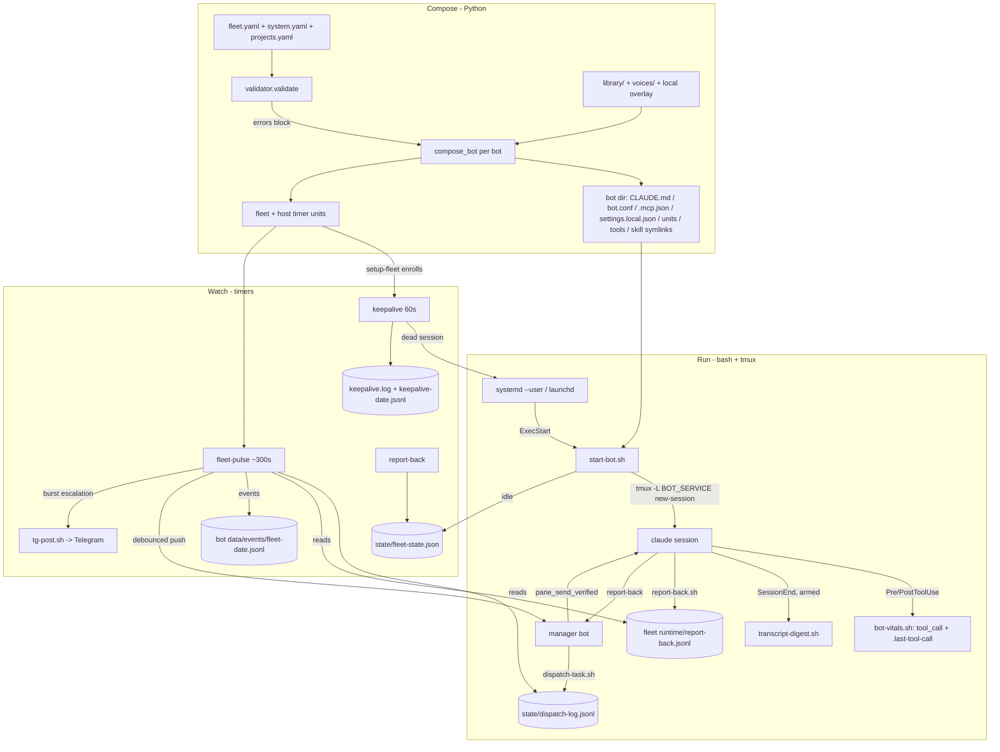

# System map — Claudlobby compositor + behavior-capture layer

## Origin

Consolidated from the audit-skill **system-lens review run of 2026-07-30** (three comprehension maps: architecture & execution flow, code structure, state/telemetry data model). Repo: `/Users/chris/Projects/Claudlobby`, branch `main`, clean at `d24d527`. Claims were **accuracy-self-checked against source at review time** — schemas and verdicts confirmed against writer source (file:line cited) and, where applicable, tests (`test_report_back.py`, `test_workstream_update.py`, `test_dispatch_overdue.py`, `test_spin_down_receipt.sh`, `test_transcript_digest.sh`, `test_events.py`); WRITE-ONLY verdicts established by repo-wide grep over `lib/`, `claudlobby/`, `library/`, `tests/`. This is a **point-in-time snapshot**: verify file:line citations against current source before acting on them months later. `local/`, `runtime/`, and `.env` were never read (PII/secrets rule), so everything here is source-verified, not live-host-verified.

## Intake

- **What it is** — compositor + supervisor for Claude Code agent fleets. A pure-Python package (`claudlobby/`) transforms `fleet.yaml` + shared `library/` through `templates/claude.md.j2` into per-bot runtime directories (composed `CLAUDE.md`, `bot.conf`, `.mcp.json`, layered `settings.local.json`, systemd + launchd units). A ~72-script bash layer (`lib/`) runs the fleet: one tmux session per bot on a private tmux server, keepalive + fleet-pulse watchdogs, verified keystroke-injection IPC, JSONL behavior ledgers.
- **Stack** — Python ≥3.10, deps PyYAML + Jinja2 only; bash 3.2-compatible `lib/` (~15.9k lines) + 5 stdlib-python helpers; runtime deps tmux, jq, curl, python3 stdlib. No daemon, no DB — flock/mkdir-locked JSON/JSONL files. Targets Pi 5-class Linux (systemd `--user` + linger) and Mac mini-class macOS (launchd).
- **Entrypoints** — `claudlobby` console script (~20 subcommands, `claudlobby/__main__.py:15`); supervision units `ExecStart=lib/start-bot.sh <bot_dir>`; fleet timers (keepalive 60s, fleet-pulse ~300s, daily/weekly jobs) + host timers (`claudlobby-<name>`); Claude Code hooks (`bot-vitals.sh` Pre/PostToolUse, `transcript-digest.sh` SessionEnd, dormant by default).
- **Test/CI** — `pip install -e '.[dev]' && pytest` (~121 test files). CI: `.github/workflows/test.yml` (ubuntu-latest, py3.11, tmux installed, one deselected test pending triage) + `conformance.yml` (vault-tests lane with pinned claudron; rename-map drift gate). Runtime-behavior changes are additionally gated by the mandatory empirical loop (`lib/validate-bot-change.sh`, `rehearse-*` harnesses) per root `CLAUDE.md`.
- **North star (evaluation frame for every finding here)** — trivial to run a fleet of distinct, cooperating bots on cheap hardware (Pi 5 / Mac mini), pointed at a goal: reliable orchestration, local-first, resource-conscious, mission-aware work selection.

## Validation baseline

`pytest -q -p no:cacheprovider` on the macOS dev host, 2026-07-30 (review snapshot, repo clean at `d24d527`):

- **Result**: 280 failed / 1855 passed / 13 skipped / 2 errors; exit observed 0 via pipe.
- **Assessment**: known macOS-environmental failure class (#686) — CI is ubuntu-latest and green; `flock` is absent locally (so `with_lock` and locked-writer test paths degrade).
- **Failure distribution (headed by)**: `test_setup_backbone` (35), `test_workstream_update` (32), `test_maintenance_jobs` (23), `test_sh_suites` (17), `test_notify_behind` (16).
- **Meaning**: on this macOS host a full green local run is not the pass signal — CI (ubuntu-latest) is the authoritative gate.

---

## Architecture & execution flow

### Executive summary

Claudlobby is a **compositor + supervisor for Claude Code agent fleets**. Compose side: `fleet.yaml` + `library/` (expertise, skills, MCP fragments, guardrails, protocols, tools) → per-bot runtime dirs with composed instructions, env contract, placeholder-only MCP config (no tokens), deny-by-default layered permissions, and both unit formats. Run side: each bot is one tmux session on its **own private tmux server** (socket == `BOT_SERVICE`), supervised by systemd `--user`/launchd, revived by a 60s keepalive, swept by fleet-pulse, with all inter-bot communication via verified tmux keystroke injection (`pane_send_verified`) and all behavior captured in JSONL ledgers (dispatch log, report-back ledger, per-bot events, workstream registry, transcript digests). Judged against the north star — *trivial to run a fleet of distinct, cooperating bots on cheap hardware, pointed at a goal* — the architecture is deliberately local-first and dependency-light, with heavy design investment in two failure classes: driving a TUI over tmux, and alerting without a human in the loop.

### Component inventory

| Component | Purpose | Entrypoint | Inputs | Outputs | Dependencies | Evidence (file:line) | Risks |
|---|---|---|---|---|---|---|---|
| CLI shell | argparse dispatch for ~20 subcommands | `claudlobby/__main__.py:15` (`main`), console script `claudlobby` | argv (`--root`, `--fleet`, `--seed`) | exit code; delegates to `args.func` | `commands/_parsers.py:30` | `__main__.py:41-50`, `pyproject.toml` `[project.scripts]` | low — thin |
| Path resolution | Root/fleet-overlay/seed path SSOT; flat `local/<fleet>` vs nested `local/<system>/<fleet>` | `paths.Paths.detect` (`paths.py:534`) | cwd/env hints, fleet name | frozen `Paths` dataclass | optional `claudron` import (vault overlay only) | `paths.py:271-530`; bash twin `resolve_fleet_dir` `lib-common.sh:1749` | dual Python/bash twin must not drift (conformance tests exist) |
| Config loader | `fleet.yaml` parsing → `FleetConfig`/`BotConfig`; merges package `system.yaml` defaults (system < fleet < bot) | `config.load_fleet` (`config.py:1326`) | fleet.yaml, projects.yaml, `claudlobby/system.yaml` | `(FleetConfig, merged_defaults)` | PyYAML | `config.py:1245-1326`, `_helpers.py:63` | 1,401-line hand-rolled schema; validator is the guard |
| Validator | Errors block generate; warnings pass unless `--strict`; env checks are **value**-based not presence-based (#755) | `validator.validate` (`validator.py:1043`) | FleetConfig, Paths, `.env` values | `ValidationReport` | `known_values.py`, `mcp_resolve.py`, `tool_resolve.py` | `validator.py:1-60`, `core.py:104-117` | permissive default: a warned-but-ignored fleet still generates |
| Composer | The pipeline core: renders every per-bot artifact + fleet/host timer units | `composer.compose_fleet` (`composer.py:2797`), `compose_bot` (`composer.py:2017`) | FleetConfig, library/, voices/, template | `runtime/bots/<bot>/{CLAUDE.md, bot.conf, .mcp.json, .claude/settings.local.json, *.service, *.plist, tools/, .claude/skills/ symlinks}`, `~/.claude/channels/telegram-<handle>/access.json`, `runtime/fleet/timers/`, `runtime/_host/timers/` | Jinja2, loader, mcp_resolve, tool_resolve, path_audit | `composer.py:2029-2093` (write order), `2081-2086` (both unit formats always) | 2,833 lines; writes outside repo (`~/.claude/channels`); mitigated by pre-write source audit `composer.py:2022-2027` |
| Loader | Library `.md` frontmatter parse, H-demotion, overlay-wins resolution; permission frontmatter extraction | `loader.load_library_items_overlay` (`loader.py:208`) | library/ + `local/<fleet>/library/` overlay | `LibraryItem`, `ExpertisePermissions` | — | `loader.py:126-155` (`_demote_headings`) | heading-depth contract on authors |
| Permission composer | Layered allow/deny: sibling-isolation deny → guardrails → expertise → MCP/integration grants (superset-asserted) → channel/skill grants → claudron-loop grants → operator allow; read-only-server write-grant assertion; fail-closed MCP trust (`enabledMcpjsonServers`) | `composer.compose_settings_local` (`composer.py:1735`) | bot config + library contracts | `settings.local.json` dict | path_audit grant classifier | `composer.py:1763-1944`, `1802-1810` (dual resolver + `_assert_grant_superset`), `1943-1944` | legacy+new grant resolvers both live (migration window) |
| Timer composer | fleet jobs (`defaults.jobs`) → `<prefix>.<job>` units + DORMANT manifest; sweep + per-(bot,slot) briefing timers w/ reconcile-prune; host jobs → fixed `claudlobby-<name>` units | `compose_fleet_timers` (`composer.py:2624`), `compose_host_timers` (`composer.py:2760`) | merged_defaults, system.yaml `host.jobs` | `.timer/.service` + `.plist` files, `DORMANT`/`BRIEFING_EXPECTED` manifests | — | `composer.py:2649-2757`; jobs list `claudlobby/system.yaml` | composed ≠ enrolled: enrollment is setup-fleet/setup-system's job |
| Drift tools | `diff` recomposes and unified-diffs; `promote` is a heuristic pointer **stub (v1)** | `diff.diff_bot` (`diff.py:28`) | runtime dir vs recompose | diff text | composer | `diff.py:1-12` ("promote is a stub") | promote does not actually extract drift |
| Audit rails | L1 source/path provenance (`path_audit`), fresh-box self-containment + secret-leak rungs (`freshbox`), L4 conformance gates | `claudlobby freshbox`; asserts inside compose | composed outputs, `.env` tiers | findings / raised errors | — | `freshbox.py:1-23`, `composer.py:2022,2088-2093` | — |
| Observability CLI | `status` (fleet-state + tmux + service + keepalive.log), `uptime` (keepalive.log MTBR), `utilization`, `events`, `report-back`, `workstreams` | `commands/core.py:284-440`, `commands/events.py:22` | the state stores (see data model) | tables/JSON | — | `status.py:1-11`, `uptime.py:1-35`, `events.py:9-20` (CRITICAL_TYPES) | read-side only; correctness depends on the writers |
| lib-common.sh | 2,303-line shared foundation: OS detect, locks, env tiering, tmux socket SSOT, bridge-state oracle, **`pane_send_verified`**, busy/idle SSOT, event emitters, error trap | sourced by every script | bot.conf, env | — | tmux, jq, python3 | `lib-common.sh:1334-1430` (send), `2093-2107` (trap), `980-1005` (events) | single point of failure by design; heavily tested |
| start-bot.sh | Bot boot: boot-mass lock, 4-file env chain, consent pre-accept, MCP checkout trust, plugin install/update, tmux spawn, bridge-readiness poll, resume + STARTUP_PROMPT injection, bridge verify | systemd/launchd `ExecStart` | bot.conf, `.env` tiers, `CLAUDE_BIN` seam | live tmux session, `logs/startup.log`, `data/.spawn`, fleet-state `idle`, `rc_timeout`/`plugin_marketplace_failed` events | claude binary, tmux, jq | `start-bot.sh:25-47,152-170,267,295-338,369-383,401` | longest, most stateful script; every step logged |
| keepalive.sh (+ keepalive-all) | 60s watchdog: dead session → restart ladder; BUSY/IDLE/UNKNOWN classify; `.idle` marker; pending `/reload`; gated bridge-heal (≤3 bounces, escalate once) | fleet `keepalive` timer → `keepalive-all.sh` → per bot | tmux pane, `data/.last-tool-call`, `.reload-pending`, `.bridge-heal` | restarts, `keepalive.log`, `data/events/keepalive-<date>.jsonl` | systemctl/launchctl | `keepalive.sh:80-103` (ladder), `260-314` (classify), `114-180` (heal) | systemd cannot see tmux death (`composer.py:955-958`) — keepalive is the only reviver |
| fleet-pulse.sh | Per-fleet sweep (default 300s): session, service, bridge, pane-stuck, WIP, activity-stuck, overdue-dispatch checks; per-bot events; debounced manager pushes keyed to manager *instance* + 6h renotify (#831); burst escalation → Telegram | fleet `fleet-pulse` timer | bot dirs, dispatch+report ledgers (via `dispatch-overdue.py --all/--orphans`), markers | `data/events/fleet-<date>.jsonl` rows, `state/pulse/*` state, `pulse-summary.txt`, tg-post escalation | python3 | `fleet-pulse.sh:130-364, 397-477` | pane_stuck & wip_uncommitted are event-only (no push); escalation covers only 4 types |
| bot-vitals.sh | Pre/PostToolUse hook: `tool_call` events + `.last-tool-call` liveness marker; never blocks (trap exit 0) | Claude Code hook (composed via system.yaml defaults) | hook JSON on stdin | event row + marker | python3 | `bot-vitals.sh:23-27,95-102`; wiring `claudlobby/system.yaml` defaults.hooks | hook can't see MCP errors / context-warnings (documented `bot-vitals.sh:77-85`) |
| transcript-digest.sh | SessionEnd hook: distil transcript (36x reduction), **redact secrets before model**, tail-cap 80k, Haiku extraction on capture rubric; `skipped` row below 6-turn gate; always writes a row, exits 0; **dormant** unless `SESSION_DIGEST_ENABLED=1` | Claude Code SessionEnd hook | hook payload, transcript JSONL | `state/transcript-digests/transcript-digest-<date>.jsonl` | claude CLI (haiku), python3 | `transcript-digest.sh:56-80, 108-152` (redaction), `222-273` (row) | model spend gate is per-fleet env; regex redaction is best-effort |
| dispatch.sh / dispatch-task.sh | Manager→worker send; task wrapper mints `t-<epoch>-<4hex>` ids, appends dispatch ledger, optional Claudron pointer preflight (fail-open), then sends `[BOTCOMMAND]` envelope | manager session / skills | worker session name, task text, `--deadline-min` etc. | `state/dispatch-log.jsonl` row + keystrokes | lib-common, dispatch-overdue.py | `dispatch-task.sh:170-215`, `dispatch.sh:38-47` (slash-command set +H exemption), `lib-common.sh:407-409` (mint) | raw-text (flag-less) dispatches are id-less → invisible to overdue watchdog (documented `dispatch-task.sh:14-17`) |
| report-back.sh | Worker→manager `[BOTREPORT]`; auto-resolves open dispatch id on terminal status (#835); appends per-fleet `report-back.jsonl`; mirrors fleet-state | worker session / skills | bot, status(completed/progress/blocked/failed), summary, extras | ledger row, manager keystrokes, fleet-state update | dispatch-overdue.py (fail-open) | `report-back.sh:91-117,142-162` | manager send is `\|\| true` (report survives even if manager gone — miss logged as `send_miss`) |
| dispatch-overdue.py | Stdlib matcher joining the two ledgers: `--all` overdue, `--orphans` (worker respawned; `.spawn` mtime), `--open-task` (report-back default id); 24h age cap `DISPATCH_OVERDUE_MAX_AGE_S` | fleet-pulse, report-back | dispatch-log.jsonl, report-back.jsonl, bots dir | text rows / one id | — | `dispatch-overdue.py:1-46` | age cap must stay below 7d ledger rotation (`lib-common.sh:415-417`) |
| fleet-state-update.sh | Locked single-writer for `state/fleet-state.json` (idle/working/blocked/offline + task fields); `prune`/`delete` subcommands | start-bot, report-back, spin-down | bot, status, task, repo | atomic JSON update | jq, flock/mkdir lock | `fleet-state-update.sh:30-109` | single-file lock design "works well for <50 bots" (own header, :17-19) |
| workstream-update.sh | Single-writer for per-fleet `workstreams.json` (open/progress/renew/block/close/prune); cap 12 active / 14-day lease from composed env; validates its own env | manager skill, dispatch-task `--workstream` | subcommand + args | locked atomic registry writes, archive JSONL | jq | `workstream-update.sh:1-70`, cap emission `composer.py:716-719` | pulse stall-consumer flagged as follow-up (header :4-5) |
| spin-up / spin-down / reconcile | Enroll+start (idempotent); guaranteed teardown w/ armed receipt to fleet ledger written *before* legs; 5-bucket supervision audit (`--enroll` fixes orphans only) | ops/manager | bot dir / fleet name | units installed/removed, `bot_teardown_started` receipt, bucket report | systemctl/launchctl | `spin-up-bot.sh:28-75`, `spin-down-bot.sh:1-30`, `reconcile-fleet.sh:1-21` | receipt dormant by default (`SPINDOWN_RECEIPT_ENABLED=1`) |
| setup backbone | `setup-system` (host prereqs + host-job enrollment), `setup-fleet` (enroll composed jobs incl. atomic legacy-keepalive swap, warm cache, spin up non-healthy bots, reconcile), `setup-fleets` | operator | composed timers + fleet.yaml | enrolled units, converging fleet | all of the above | `setup-fleet:1-35` | apply-only; never composes (must run generate first) |
| Triggers | `sprint-trigger.sh` (schedule → `/autonomous-sprint` if manager idle), `briefing-trigger.sh` (timer → `/briefing <slot>`, defer-with-event if busy), `bot-sweep-cron.sh` | timers/cron | manager/bot session state | slash-command injections, `briefing_deferred` events | bot_is_busy SSOT | `sprint-trigger.sh:24-39`, `briefing-trigger.sh:1-40` | injection-only nudges; skip beats queue by design |
| Host jobs | disk-monitor, fleet-memory-check, host-health-check (hourly; Pi under-voltage/SD stalls), orphan-browser-reaper, claude-update (staged download), notify-behind | host timers (`claudlobby-<name>`) | host state | FLEET ALERT/NOTICE via `_emit_fleet_signal` | vcgencmd (Pi), journal | `claudlobby/system.yaml` host.jobs; `lib-common.sh:2017-2091` | alerts depend on ≥1 bot.conf declaring a chat id |

### Entrypoints & execution surfaces

**Long-running processes** — none owned by claudlobby itself. The only long-lived processes are per-bot tmux servers running `claude` (spawned by `start-bot.sh:267`) and Claude Code's own MCP children (incl. the Telegram `bun server.ts` poller). Everything else is oneshot.

- **CLI** (`claudlobby ...`): `validate`, `generate [--bot] [--strict]`, `host-timers`, `list-library`, `diff`, `promote`, `status [--json]`, `report-back`, `workstreams [list|show]`, `uptime`, `events`, `freshbox [--strict --reap]`, `doctor`, `warm-cache`, `move-bot`, `new-bot|new-skill|new-guardrail`, 5 `*-migrate` commands (`commands/_parsers.py:30-382`). Overlay selection: `--fleet <name>` → `local/<fleet>/` (or nested `local/<system>/<fleet>/`); default root mode.
- **Fleet timer jobs** (composed from `system.yaml defaults.jobs`, enrolled by setup-fleet): `keepalive` 60s → `keepalive-all.sh`; `fleet-pulse` (interval from `observability.pulse_interval`, default 300s); `log-rotation` daily; `creds-check` daily 06:00 (+600s jitter); `reload-fleet` daily 03:30 (plugin update + generate + `.reload-pending` markers); `data-sweep` Sat 07:00; `weekly-worker-restart` dormant (`enroll: false`); `code-audit-sweep` opt-in via `fleet.sweep`; `briefing-<bot>-<slot>` per-(bot,slot) OnCalendar → `briefing-trigger.sh`.
- **Host jobs** (singletons, `claudlobby-<name>` identity, enrolled by setup-system): claude-update 04:00, notify-behind 08:00, disk-monitor 05:00, fleet-memory-check 05:30, orphan-browser-reaper 05:45, host-health-check hourly (`claudlobby/system.yaml host.jobs`).
- **Hooks** (composed into every bot's settings.local.json via system.yaml `defaults.hooks`): `PreToolUse`+`PostToolUse` → `bot-vitals.sh`; `SessionEnd` → `transcript-digest.sh` (timeout 150, dormant by default). Vault-wired bots additionally get merged SessionStart/PreCompact/SessionEnd engine hooks (`composer.py:1919-1934`).
- **Supervision entry**: systemd unit `ExecStart=lib/start-bot.sh <bot_dir>` with `RemainAfterExit=yes`, `KillMode=process`, `ExecStop` = tmux **kill-server**, `Restart=on-failure` (start-script failures only — tmux death is keepalive's job) (`composer.py:935-966`). launchd plist: `RunAtLoad` + `KeepAlive.SuccessfulExit=false` (`composer.py:973-1005`).

### Key dependencies & integration points

- **tmux** — the fleet's IPC bus and process container. One private server per bot (`-L $BOT_SERVICE`, `TMUX_TMPDIR` pinned to `/tmp` — `composer.py:449,590`); all dispatch/report/alert/nudge traffic is `send-keys` through `pane_send_verified` (`lib-common.sh:1334`); liveness and busy/idle read via `capture-pane` + marker files. Session name = bot-dir basename (`lib-common.sh:456`).
- **systemd --user / launchd** — supervision + timers. Requires `loginctl enable-linger` on Linux (`keepalive.sh:182-187` sets `XDG_RUNTIME_DIR` for cron contexts). Both unit formats always composed; the platform picks at enroll time (`spin-up-bot.sh:28-75`).
- **Telegram** — two paths: (1) the channel plugin (a `bun server.ts` MCP child of `claude`, external to this repo) for inbound/outbound chat — its health is the "bridge" (`bridge_state`, ownership-verified via `/proc/<pid>/environ` or `ps eww`, `lib-common.sh:522-584`); (2) `tg-post.sh` — direct Bot-API curl for env-less/host callers and FLEET ALERT/NOTICE delivery (`tg-post.sh:1-44`). Token flows by *name indirection* (`TELEGRAM_TOKEN_ENV_NAME` in bot.conf → value in .env tiers); empty tokens are unset, never exported (`start-bot.sh:55-65,183-190`).
- **Claude Code binary** — `claude` on PATH (overridable `CLAUDE_BIN` test seam, `start-bot.sh:192-204`); plugin marketplace/install/update at boot (`start-bot.sh:218-265`); daily staged download via `update-claude-code.sh`, applied only on natural/weekly restarts.
- **npx MCP servers** — `.mcp.json` keeps `${VAR}` placeholders (canonicalized, instance-aware — `mcp_resolve.py:26-60`); `warm-cache` pre-downloads packages (Pi cold-start mitigation, `core.py:443-534`); `_global_binary` rewrites `npx` → `node <resolved>` saving ~0.8s/server (`composer.py:210-226`).
- **GitHub / gh** — fleet-ops scripts (`code-audit-sweep.sh` selects repos via `auto-audit` issues; `ci-health-check.sh`; `notify-behind.sh` compares against origin).
- **Claudron (sibling)** — consumed strictly by contract: optional `[vault]` pip extra pinned `v0.4.0` (`pyproject.toml`), `claudron` CLI door for the dispatch query-before wedge (fail-open, pointers only — `dispatch-task.sh:98-168`), `claudron_compat.py` capability floor, vault-mode hook merge (`composer.py:1919-1934`). Only `paths.py` may import `claudron.*`.
- **jq / python3** — jq for locked JSON mutation (fleet-state, workstreams); python3 (stdlib only) for ledger matching, vitals parsing, digest distillation.

### Configuration & environment assumptions

- **`fleet.yaml`** (gitignored; `fleet.yaml.example` committed): `fleet.{name, service_prefix, telegram_group_chat_id, accounts, defaults, teams, bots, plugins, workstreams, sweep, mission/mission_file, env}` — parsed only in `config.py` by design. Per-bot: expertise/skills/mcp/guardrails/protocols/resources/lessons/permissions/post_actions/voice/scope/model/effort/account/channels/telegram/briefing/autonomous_runner/sandbox/tools.allow|deny/env/secret_files (`config.py:389+`).
- **`system.yaml`** (package-owned `claudlobby/system.yaml`): `host.jobs` + `defaults.{hooks, observability, jobs}`; merge order system < fleet `defaults:` < bot; `system_defaults:` toggles remove categories (`config.py:1291`).
- **`projects.yaml`** (beside fleet.yaml): project → repos + validation tier (auto/review/preview/human); emitted into every bot.conf as `PROJECT_TIER_<SLUG>` / `PROJECT_REPOS_<SLUG>` (`composer.py:685-708`).
- **`.env` tiers** (values never composed; 4-file source chain at boot, `start-bot.sh:152-162`): `~/.env` → `${CLAUDLOBBY_ROOT}/.env` → `local/<fleet>/.env` → `<bot_dir>/.env`. Key **names** observed in `.env.example` (names only, values are placeholders): `TELEGRAM_BOT_TOKEN`, `TELEGRAM_GROUP_CHAT_ID`, `GITHUB_PAT`, `NOTION_TOKEN`, `SLACK_TOKEN`, `GOOGLE_OAUTH_CLIENT_ID/SECRET`, `SHOPIFY_*`, `SPOTIFY_*`, `HA_URL/TOKEN`, `NEON_API_KEY`, `RAILWAY_API_TOKEN`, `SNOWFLAKE_*`, `PRINTIFY_*`. Freshbox #792 fails a *bot-tier* secret found in a *host-shared* tier (`freshbox.py:18-23`).
- **`bot.conf`** (composed, sourced with `set -a` at boot): identity (`BOT_ID/BOT_NAME/BOT_SERVICE/TMUX_SOCKET/BOT_LABEL/BOT_DIR/TELEGRAM_STATE_DIR`), `CLAUDLOBBY_ROOT`, `CLAUDE_CONFIG_DIR` (multi-account), `CLAUDE_FLAGS` (channels/remote-control/permission-mode — default `acceptEdits`/model/effort), headless-trim vars, `FLEET_NAME/SERVICE_PREFIX/TMUX_TMPDIR/FLEET_STATE_PATH/FLEET_ROOT/FLEET_MISSION_FILE`, Telegram vars, `MODEL_STRATEGY_*`, `OBSERVABILITY_*` (pulse 300 / reap 7d / activity-stuck 1800 / dispatch-deadline 1800 / bridge-heal), `PROJECT_*`, `WORKSTREAM_MAX_ACTIVE=12`/`WORKSTREAM_LEASE_DAYS=14`, `SWEEP_*` (owner only), `BRIEFING_*`, ecosystem pins (`CLAUDNA_VERSION`, `CLAUDRON_VAULT_PATH`, `CLAUDOSSEUM_TENANT_ID`), plugin sync vars, per-bot `env:` passthrough (anchored-path aware), `secret_files` → `$FLEET_ROOT/`-anchored exports, `MANAGER_TMUX(+_SOCKET)`, `STARTUP_PROMPT` (`composer.py:494-860`).
- **Dormant-by-default switches** (armed per fleet in `fleet.yaml env:`): `SESSION_DIGEST_ENABLED`, `SPINDOWN_RECEIPT_ENABLED`, `OBSERVABILITY_BRIDGE_HEAL`, `CLAUDRON_QUERY_BEFORE`; per-job `enroll: true` for dormant timers.
- **Runtime knobs read per-call** (not composed): `KEEPALIVE_{ACTIVE_WINDOW_S, IDLE_PATTERNS, BUSY_PATTERNS, UNKNOWN_THRESHOLD, REAP_DAYS}`, `PANE_SEND_{SETTLE_S, VERIFY_TICKS}`, `PANE_RECOVER_TICKS`, `RC_READY_TIMEOUT_S`, `RESUME_MAX_AGE_S`, `DISPATCH_OVERDUE_MAX_AGE_S`, `FLEET_PULSE_{RENOTIFY_AFTER_S, ESCALATION_THRESHOLD, ESCALATION_WINDOW, ESCALATION_CHAT_ID}`, `BOOT_LOCK_HOLD_S`.

### Error handling & retry strategy

- **`install_error_trap` (`lib-common.sh:2093-2107`)** — the fleet's error breadcrumb: arms `set -E` (errtrace) so the ERR trap fires inside functions (#844 fix), then emits a `script_error` event (`{script, exit_code, "non-zero exit at line N"}`) to the bot's or fleet ledger. Trap stdout is discarded (under errtrace it fires *inside* command substitutions and would poison captured values). **Coverage gap by contract**: scripts hand-rolling `trap ... ERR` (none observed in lib/ mainline; `bot-vitals.sh:25` and `transcript-digest.sh:57` deliberately use `trap 'exit 0' ERR` instead) and deliberate `|| true` tolerance are silent.
- **Hooks never block**: bot-vitals and transcript-digest trap all errors to exit 0; digest failure paths still write a row (status `error`) (`transcript-digest.sh:53-57`).
- **Event writes are best-effort everywhere**: `emit_fleet_event` returns 0 on mkdir/append failure (`lib-common.sh:999-1004`) — observability must not break the observed path; consequence: an unwritable disk loses events silently (disk-monitor is the compensating control).
- **Keystroke delivery ladder** (`pane_send_verified`, `lib-common.sh:1334-1430`): await input box (boot callers only, 45s budget; verdict pair drawn/never/unverified/unwaited), send text → settle 0.3s → Enter → poll ≤5x0.2s; payload still visible ⇒ one Enter resend + `send_retry` event; box never drew ⇒ 12s recovery window, whole-payload resend via `_pane_recover_unconfirmed_send`, `send_blind` event; cross-socket precheck miss ⇒ `send_miss` event + rc≠0 (`bot_tmux_send`, :1029-1047). Residual mid-turn race is a **stated bound**, not silent (:1388-1397).
- **Restart ladder** (`keepalive.sh:80-103`): one consolidated path (systemd → legacy unit → launchd → direct start-bot); bridge-heal capped at 3 persisted attempts then a single escalation (:153-180); every branch re-touches `.spawn` so the down-grace spaces retries.
- **Boot races**: fleet-wide mkdir boot lock (stale >60s force-claimed, contention bail >120s, `start-bot.sh:25-47`); consent-file update under lock (:80-94); `;` not `&&` before `exec claude` so a benign nonzero from the token block cannot kill the pane (:199-207).
- **Compose-time**: fail-loud with no partial output — source audit before first write (`composer.py:2022-2027`), post-write path assertion (:2088-2093), `compose_fleet` collects *all* bot failures before raising (:2813-2829). Validation errors block generate (`core.py:106-110`).
- **Fail-open seams (deliberate)**: Claudron preflight (`dispatch-task.sh:103-168` — any failure degrades to plain send), report-back's open-task resolver (`report-back.sh:85-99`), manager notify paths (`|| true`), plugin install failures (never block boot, but marketplace registration is *verified against the registry* and event-emitted on failure, `start-bot.sh:238-249`).
- **Retry-with-cap patterns**: overdue re-emission capped by 24h age-out (#460); alert re-notify at 6h; escalation debounced 10 min; UNKNOWN pane counter threshold 3.

### Observability & alert routing

**Event row schema (uniform)**: `{"ts","bot","type","source","data"}` — one emitter (`emit_fleet_event`, `lib-common.sh:980-1005`), sources: `vitals`, `pulse`, `keepalive`, `dispatch`, `startup`, `lib`, `alert`, `notice`. Full store inventory: see the writers → readers matrix (Code map) and the artifact catalog (State & telemetry data model) below.

**Alert routing — three rungs**: (1) per-bot event row (always); (2) debounced manager tmux push `[FLEET-PULSE]`, keyed to manager *instance token* `session_created-pane_pid` so a manager restart re-arms it, 6h re-notify (`fleet-pulse.sh:52,83-119`); (3) Telegram — `FLEET ALERT`/`FLEET NOTICE` via `_emit_fleet_signal` (manager nudge + tg-post, `lib-common.sh:2017-2091`) and fleet-pulse's burst escalation (≥2 bots with `service_down|session_missing|bridge_down|rc_timeout` inside a 10-min window, 10-min debounce, `fleet-pulse.sh:397-477`). No resolvable chat id ⇒ loud stderr warning (:414-416).

**What fails silently / is unmeasured** (verified): `pane_stuck` and `wip_uncommitted` are ledger-only (no push, no escalation); a live-but-RC-dark session is only burst-detected at startup (`rc_timeout` is emitted once by start-bot — the durable-marker parity fix is an acknowledged deferred follow-up, `fleet-pulse.sh:424-433`); `tg-post` delivery failures are swallowed (`|| true` at every call site); `emit_fleet_event` write failures drop the row; `state/fleet-utilization.json` has a writer but **no reader/timer yet** (`utilization.py:10-17`); flag-less `dispatch.sh` sends bypass the ledger entirely; `bench-cold-start.sh` logs CSV with no regression detection (root CLAUDE.md table).

### Deployment & runtime assumptions

- **Target hardware**: Pi 5-class Linux (systemd --user + linger; `vcgencmd` under-voltage/thermal and SD/MMC-stall checks in host-health-check; boot stagger `ExecStartPre=sleep i*3` per bot, `composer.py:934, 2270`; npx warm-cache; CPU-conscious polling documented `lib-common.sh:1160-1165`) and Mac mini-class macOS (launchd LaunchAgents; no stagger — "more cores/RAM", `composer.py:969-972`; flock absent ⇒ mkdir spinlock; BSD date/stat/sed fallbacks throughout lib-common).
- **bash 3.2 floor** (macOS `/bin/bash`): no `${!var}` in session-shell contexts (eval indirection, `start-bot.sh:172-190`), no-apostrophe-in-`$( )`-comments rule gated by `tests/test_bash_parse.py`.
- **cron as fallback plane**: `install-cron.sh`, `bot-sweep-cron.sh`; keepalive exports `XDG_RUNTIME_DIR` for minimal cron envs (`keepalive.sh:182-187`).
- **Filesystem layout**: shared install at `$CLAUDLOBBY_ROOT` (lib/ cannot be staged per-bot — hence the dormant-switch pattern for new destructive/spendy behavior); fleets under `local/` (flat or nested vault-system container); `~/.claude` per account via `CLAUDE_CONFIG_DIR`; `~/.claude/channels/telegram-<handle>/` channel state.
- **Update lifecycle**: daily `reload-fleet` (live plugin/skill reload via keepalive `/reload`), daily staged binary download, weekly worker restart (opt-in), `rolling-restart.sh` serializes restarts gated on fresh `BRIDGE_READY` so a mass restart can't land the fleet inbound-dead (#689).
- **CI**: see Intake. Runtime-behavior changes additionally gated by the mandatory empirical loop (`validate-bot-change.sh`, `rehearse-*` harnesses) per root CLAUDE.md.

### Critical-path walkthroughs

Narrative walkthroughs; the precise step-by-step paths with full line refs are Flows F1, F2, F3, F6 in the Code map below.

**Generate (composition) — `claudlobby --fleet F generate`**

1. `main` → `cmd_generate` (`core.py:98`): `_resolve_paths` (overlay dir, flat-or-nested, `_helpers.py:17-51`) → `_load_env` (repo/fleet `.env` into process env) → `load_fleet` (`config.py:1326`; merges `claudlobby/system.yaml` defaults under fleet defaults).
2. `validate()` (`validator.py:1043`) — errors abort; warnings logged (abort under `--strict`) (`core.py:106-117`).
3. Per bot, `compose_bot` (`composer.py:2017`): **pre-write L1 source audit** (`assert_bot_sources`) → mkdir tree → `CLAUDE.md` (overlay-first library load, heading demotion, `{{BOT_NAME}}` expansion, Jinja sandbox; managers get team/projects tables + double-demoted charter, workers a `$FLEET_MISSION_FILE` pointer, `composer.py:1292-1393`) → `.mcp.json` (fragments merged per instance, `${VAR}` canonicalized not resolved, npx→node rewrite) → `bot.conf` (env contract; shell-safety asserts) → `settings.local.json` (permission layers; fail-closed `enabledMcpjsonServers`; hooks incl. dormant SessionEnd) → skill symlinks + mounts + rendered `tools/` (0755) → Telegram `access.json` reconciled into `~/.claude/channels/` → **both** `.service` and `.plist` (boot stagger i×3s) → post-write path assertion.
4. `compose_fleet` collects all per-bot failures then raises once; `scaffold_env_files` writes empty `export VAR=` stubs for every collected env contract (:2797-2833, 2108+).
5. Unconditionally: `compose_fleet_timers` (jobs + DORMANT manifest + sweep + briefing units with reconcile-prune) and `compose_host_timers` (`core.py:130-143`). **Composition ends here — enrollment is `setup-fleet`/`setup-system`.**

**Dispatch → work → report-back (the work loop)**

1. Manager session runs `dispatch-task.sh --repo X --workstream ws-… <worker> <task>`: session precheck on the worker's own socket (fail-before-record, `dispatch-task.sh:93-96`) → optional Claudron pointer prefix (fail-open) → mint `t-<epoch>-<4hex>` → locked append to host-global `state/dispatch-log.jsonl` with `expected_by` deadline (=now+`OBSERVABILITY_DISPATCH_DEADLINE`|`--deadline-min`), self-rotate (:170-212) → `dispatch.sh` builds the payload (slash-command exemption from the `set +H;` guard, `dispatch.sh:38-42`) → `bot_tmux_send` → sanitize → `pane_send_verified`.
2. Worker receives `[BOTCOMMAND] mgr | task | … | task:<id>` as pane input; does the work inside its own Claude session (each tool call touches `.last-tool-call` via bot-vitals).
3. Worker runs `report-back.sh <bot> completed "summary" --pr …`: terminal status with no `--task` auto-resolves the bot's open dispatch id via `dispatch-overdue.py --open-task` (#835, fail-open, `report-back.sh:91-101`) → `[BOTREPORT]` sent to `MANAGER_TMUX` on `MANAGER_TMUX_SOCKET` (miss ⇒ `send_miss`, never fatal) → locked append to per-fleet `report-back.jsonl` → fleet-state mirrored (completed/failed→idle, blocked→blocked, progress→working, :151-162).
4. Watchdog: each pulse runs `dispatch-overdue.py --all/--orphans` once (`fleet-pulse.sh:130-144`); a row past `expected_by` with no terminal report emits `overdue_dispatch` + debounced manager push naming open ids; a respawned worker's row becomes `dispatch_orphaned` (latched once — actionable for re-dispatch, never an alarm loop); rows age out at 24h (#460).

**Crash → keepalive → restart → pulse alert (the recovery loop)**

1. Bot's `claude` or tmux server dies. The systemd unit stays `active` (`RemainAfterExit=yes` — systemd cannot see it, `composer.py:955-958`).
2. Within ~60s the fleet `keepalive` timer → `keepalive-all.sh` (declared+supervised bots only) → `keepalive.sh`: `check_tmux_session` fails → 1s re-check (start-bot race) → `restart_bot_service "session dead"` → systemctl restart / launchctl kickstart / direct `start-bot.sh` — logged to `keepalive.log` + `RESTART` event (`keepalive.sh:194-204, 80-103`).
3. `start-bot.sh` reboots the bot: env chain, plugins, tmux spawn, `.spawn` touch, bridge-readiness poll (≤90s; timeout ⇒ `rc_timeout` event), fresh-checkpoint resume (`/claudna:session resume --auto` if `session.md` <24h), STARTUP_PROMPT, fleet-state `idle`, bridge verify (missing escalates tmux-first; keepalive owns the heal ladder).
4. In parallel, `fleet-pulse.sh` (≤300s) emits `session_missing`/`service_down` while down and pushes `[FLEET-PULSE]` to the manager (debounced per manager-instance, 6h renotify); if ≥2 bots share a critical type within 10 min (mass-restart signature #533/#689) the burst escalation posts `FLEET ALERT` to Telegram via `tg-post.sh` (`fleet-pulse.sh:202-228, 418-477`). Recovery clears the debounce markers on the next healthy sweep; `claudlobby uptime` later derives MTBR/uptime% from the keepalive.log lines.



---

## Code map

### Layer boundaries

| Layer | Location | Role | Talks to |
|---|---|---|---|
| **Compositor** (Python ≥3.10, deps PyYAML+Jinja2 only) | `claudlobby/` | Transforms `fleet.yaml` + `library/` + `templates/claude.md.j2` into per-bot runtime dirs and timer units; validates; audits; read-only observability CLIs | Reads library/templates; writes `runtime/bots/`, `runtime/fleet/timers/`, `runtime/_host/timers/`; reads state files for `status`/`uptime`/`events`/`workstreams` |
| **Runtime scripts** (bash 3.2-compatible + 5 stdlib-python helpers) | `lib/` (~72 files, 15.9k lines) | Supervision, dispatch, reporting, monitors, timers, migrations, rehearsal harnesses | Source `lib/lib-common.sh`; read composed `bot.conf`; write state ledgers/events/logs; drive tmux + systemd/launchd + Telegram |
| **Library content** | `library/{expertise,skills,mcp,guardrails,protocols,integrations,resources,lessons,principles,permissions,post_actions,tools}/`, `voices/`, `templates/` | Composable prose/config blocks; skills are *fleet operations* (dispatch, restart, pulse) | Consumed only by the compositor (loader.py) and, at runtime, by bots via composed CLAUDE.md / skill symlinks |
| **Tests** | `tests/` (121 entries; pytest + a few `.sh` harnesses) | Composition unit tests + script wrappers (`test_bash_parse.py` gates bash-3.2 parseability of `lib/` and `library/**/*.sh`) | — |
| **Fleet overlays** (not read) | `local/<fleet>/` or nested `local/<system>/<fleet>/` | fleet.yaml, .env, library overrides, runtime output | Resolved by `paths.py` (Python) / `resolve_fleet_dir` (bash) — declared twins |

Boundary rules (from `claudlobby/CLAUDE.md`, `lib/CLAUDE.md`): only `paths.py` may import `claudron.*`; `lib/` never opens vault note files (CLI door only, titles+pointers); skills/behavior are never hardcoded in compositor logic.

### Compositor package (`claudlobby/`)

**CLI shape** — `__main__.py:15` `main()`: argparse root (`--root`, `--fleet`, `--seed`, `-v`), delegates registration to `commands/_parsers.py:register_subparsers`, then `args.func(args)`. `commands/core.py` holds validate/generate/host-timers/list-library/diff/promote/status/freshbox/doctor/report-back/workstreams/uptime/warm-cache; plus `events.py`, `move_bot.py`, `scaffolding.py`, 5 migration modules, `_helpers.py` (`_resolve_paths` → `Paths.detect`, `_load_env` → dotenv, `_load_fleet_or_exit`).

**Config & paths**
- `config.py:1326` `load_fleet(fleet_yaml) -> (FleetConfig, merged_defaults)`: coerces teams, bots (`_coerce_bot` with merged defaults), plugins, sweep, workstreams (defaults max_active=12/lease_days=14), mission/mission_file, `projects.yaml` (`load_projects`).
- System defaults tier: `_resolve_system_yaml` (config.py:1245) loads package-owned `claudlobby/system.yaml` (errors if stale `system_defaults.yaml` lingers); `fleet.system_defaults` toggles slice hooks/observability/jobs before `_merge_system_into_defaults`. `load_host_jobs()` (config.py:1276) feeds host-global timers.
- Dataclasses: `BotConfig` (config.py:390), `FleetConfig` (config.py:534, incl. `manager_bots()`).
- `paths.py:272` `Paths` dataclass. Key properties: `fleet_yaml` (seed/overlay/root), `runtime`, **`fleet_state`** (paths.py:516 — overlay `local/<fleet>/runtime/`, root-mode `runtime/fleet/`; declared bash twin `fleet_runtime_dir`), `env_file`, `library_search_dirs` (overlay-first). `Paths.detect` (paths.py:533): start = hint > `$CLAUDLOBBY_ROOT` > cwd; root marker = dir containing `library/` + `lib/`; fleet resolution tries the `.claudron` vault bridge then flat/nested `local/` (`_find_fleet_dir`).
- `known_values.py` — SSOT value sets shared by config + validator; `closest_match`/`hint` typo suggestions.

**Library loading (`loader.py`)** — `load_library_item` (183): frontmatter parse, title derivation, `_strip_leading_title_heading`, **`_demote_headings` (126)** (every body's headings shift down one level so the template owns structure). `load_library_items_overlay` (208) resolves overlay-then-base. Expertise special-cased (`parse_expertise_file` 264: `title_label` + `ExpertisePermissions`). Grant readers shared with composer/validator/freshbox: `iter_skill_grants` (361), `iter_guardrail_permissions` (382), `iter_integration_grants` (406).

**Generation pipeline (composer.py)** — `compose_fleet` (2797) → per-bot `compose_bot` (2017), collecting failures per bot (all offenders reported in one pass, 2813-2829), then `scaffold_env_files` (2242, from `collect_env_contracts` 2108 walking MCP fragment `_env_contract`s). `compose_bot` order — **fail-before-write, then idempotent overwrite**:

1. `path_audit.assert_bot_sources` (2027) — L1 source guard: deny unanchored/undeclared absolute paths in bot config leaves + MCP fragment leaves *before first disk write*.
2. mkdirs (2029-2035): `.claude/`, `memory/`, `projects/`, `data/`, `data/events/`, `logs/`.
3. `CLAUDE.md` ← `compose_claude_md` (1292): `_compose_expertise` (92, first file's H1 = title label), voice, `_items()` per kind expanded with `{{BOT_NAME}}`-style ctx (`_expand` 48 — plain replace, missing keys left as-is), auto-adds `shared-documentation` protocol, managers get projects table + double-demoted mission charter (1353-1366), renders `templates/claude.md.j2` in a **SandboxedEnvironment** (also used for `_render_startup_prompt` 863); emit-time corruption backstops raise on newline/pipe in titles/mission (1333-1352).
4. `.mcp.json` ← `compose_mcp_json` (181): per `McpEntry` instance; `_global_binary` npx→node rewrite (211-226); `${VAR}` canonicalization via `mcp_resolve.resolve_placeholders` (instance-scoped prefixing).
5. `bot.conf` ← `compose_bot_conf` (494): shell-safety asserts (`_SAFE_NAME_RE`, `_TELEGRAM_HANDLE_RE`, `_SHELL_IDENT_RE`); everything `_shq` (shlex.quote) except **anchored paths** emitted double-quoted (gated `is_safe_anchored_path`, #731) and `secret_files` forced `"$FLEET_ROOT/<subpath>"` with `is_safe_relative_subpath` (809-833). `MANAGER_TMUX(+_SOCKET)`: worker → team manager; manager → self (837-849).
6. `.claude/settings.local.json` ← `compose_settings_local` (1735) — **the permission engine**. Deny layers: sibling isolation Read/Write/Edit on every other bot's dir (1766-1778); guardrail deny; expertise deny; bot `tools.deny` (wins over all allows, 1839-1841). Allow layers: expertise → guardrail-allow → MCP grants (legacy `_resolve_mcp_permissions` 275 ∪ new `_resolve_integration_grants` 388; `_assert_grant_superset` 1716 proves new ⊇ legacy) → channel tools → `Skill()` patterns → skill `tool_grants` → Claudron loop grants (`CLAUDRON_LOOP_GRANTS` 1454, narrow verbs, never `Bash(claudron *)`) → **invariant `_assert_no_write_autoallows` (347): no library-derived allow may cover a write of a read-only-contracted server (#661)** → operator `tools.allow` (exempt escape hatch). `BASE_TOOLS` auto-inserted when allow non-empty. L1 grant-path guard (1850-1881). Also: sandbox block (default disabled, `enabled` always emitted, 1893-1917), hooks (`_compose_hooks` 1401 flat→matcher-group transform; `_merge_claudron_hooks` 1538 self-replacing by `hook <event>` suffix when `_session_loop_enabled` 1469 — default true iff vault-wired; `_resolve_claudron_executable` 1478 `shutil.which` at compose time, cached, warns on bare fallback), `enabledPlugins`, `extraKnownMarketplaces`, **`enabledMcpjsonServers`** (fail-closed MCP trust re-derived each generate; blanket `enableAllProjectMcpServers` deliberately never emitted — 1741-1754), headless UX + consent skip-flags (1946-1960).
7. `link_skills` (1013) symlinks into `.claude/skills/`; `link_mounts` (1065); `compose_tools` (1164, via `tool_resolve.py` manifest+Jinja → `tools/` 0755).
8. Telegram `access.json` → `~/.claude/channels/telegram-<handle>/` — write fresh or `_reconcile_access_json` (1965: fleet-controlled fields updated, runtime state preserved; unreadable file → warn + leave unchanged).
9. `<prefix>.<bot>.service` (`compose_systemd_unit` 929 — `RemainAfterExit=yes`, `KillMode=process`, `ExecStop tmux -L <svc> kill-server`, `Restart=on-failure` fires only if start-bot exits non-zero; **tmux death post-boot is keepalive's job**) + `.plist` (`compose_launchd_plist` 973). Boot stagger: `boot_delay_s=i*_BOOT_STAGGER_SECONDS` → `ExecStartPre=/bin/sleep`.
10. `path_audit.assert_bot_paths` (2093) — post-write wiring-file audit (flat/dangling absolute fleet paths fail loud).

Timers: `compose_fleet_timers` (2624) emits merged `defaults.jobs` units + opt-in `code-audit-sweep` + per-(bot,slot) briefing units into `runtime/fleet/timers/`; `enroll: false` jobs land in a `DORMANT` manifest (2692-2703, read by `unit_is_dormant` lib-common:1929); `BRIEFING_EXPECTED` manifest written *before* the unit loop so a torn generate is detectable; `_reconcile_briefing_units` prunes removed slots with a count-check guard. `compose_host_timers` (2760) emits `claudlobby-<name>` singleton units. `_scheduler_tool_path` (890) bakes a PATH (incl. `<root>/.venv/bin`, #805) so timer jobs resolve `claude`/`claudlobby`.

**Validation, drift, audits**
- `validator.py:1043` `validate()` → `ValidationReport{errors,warnings}`: `_validate_bots` (143 — library refs exist, env contract vars present via `_env_has_value`, MCP fragment shape, grant shape warnings), teams, fleet, timers (script paths via `path_audit.timer_script_findings`), mission pairing, workstreams bounds, sweep, projects, cross-fleet collisions (945), library frontmatter (1000).
- `diff.py:28` `diff_bot` recomposes CLAUDE.md/.mcp.json/bot.conf/tools in memory, unified-diffs vs disk; `diff_fleet_timers` (122) composes into a temp dir with the same Paths surface; `promote_bot` (181) extracts drift back to library (stub, see component table).
- `freshbox.py` (#644/#703): `audit_bot` 455 — over-grant/orphan (`classify_grants` vs `_sourced_grants`), under-grant, Tier-A composed-not-inherited (`_tier_a_findings`), denied source values, externals report, fleet-tier `.env` guard + secret-leak scan (`_env_secret_leak_findings` 269, `_mask` 193 never prints values), orphan unit reaping.
- `path_audit.py`: anchor grammar (`is_anchor_headed` 483, `is_safe_anchored_path` 511), `classify_source_value` 344, `ExternalDecl`/`match_external`, `audit_bot_sources` 681 / `audit_bot_paths` 224 / `classify_grant_paths` 471 — used at both compose gates.
- `doctor.py:598` `run_doctor` — env vars, MCP configs, npx cache, services, credentials (live curl probes via `_curl_with_config` — token via config file, not argv), claudron floor (`claudron_compat.py`), fleet validation summary.
- `conformance.py` — L4 gates: clauDNA skill rename-map drift (clones pinned ref), boundary invariants.

**Observability CLIs (read-only)**
- `status.py:225` `collect_fleet_status` — merges fleet-state.json (`utilization.load_fleet_state`), live tmux (`_check_tmux_sessions`, per-bot sockets), unit state (keyed on `BOT_SERVICE` label read from the composed unit file `_read_service_label` 211), keepalive.log tail (`_parse_keepalive_log` 178), busy% from `compute_bot_utilization`.
- `uptime.py` — parses `keepalive.log(.N)` text lines (`_LOG_LINE_RE` 20: `BUSY|IDLE|RESTART|UNKNOWN|SKIP`), computes uptime/MTBR/restart-rate per window; gaps >10min (`_MAX_INTERVAL_SECS=600`) excluded.
- `utilization.py` — same log entries → busy% 24h/7d (`_compute_busy_pct` 50); `load_fleet_state` (111: `$FLEET_STATE_PATH` env else `<root>/state/fleet-state.json`); `write_utilization_json` (216) → `paths.runtime/state/fleet-utilization.json` (per-fleet runtime, despite the "state/" phrasing in `lib/fleet-utilization.sh` header).
- `workstreams.py` — read-only view of `paths.fleet_state/workstreams.json` (registry_path 16); corrupt/missing → `{}`.
- `commands/events.py` — `collect_events` (22) reads every bot's `data/events/*.jsonl` **plus** the fleet ledger `<root>/state/events` (events.py:136); `CRITICAL_TYPES` (9): session_missing, service_down, activity_stuck, script_error, overdue_dispatch, bridge_down, reload_failed, restart_failed, rc_timeout.
- `commands/core.py:320` `cmd_report_back` — reads `paths.fleet_state/report-back.jsonl` with `--since/--bot/--status`; malformed lines skipped silently.

### Runtime layer (`lib/`)

#### `lib-common.sh` (2,303 lines) — the shared primitive layer

| Concern | Functions (line) | Notes |
|---|---|---|
| OS/tools | `detect_os` 59 (sets `_OS`, `_HOMEBREW`); `with_timeout` 168 (gtimeout fallback; **no timeout binary → runs unguarded**); `with_lock` 181 (**flock, else mkdir spinlock: ~100x50ms then proceeds best-effort — lock can be bypassed under contention on flock-less hosts**) | |
| Env/conf | `load_bot_conf` 201; `parse_env_file` 215 (restricted parser: rejects `$(`, backticks, pipes, semicolons; exports rest); `source_env_tiered` 254 (`~/.env` → deprecated root `.env` → fleet `.env` → bot `.env`); `bot_conf_get` 2108 (grep-read w/o sourcing); `bot_conf_get_path` 2130 (expands `$HOME`/`$CLAUDLOBBY_ROOT`); `extract_bot_conf_var` 1982 | 3-tier env duplicated inside `.tmux-env` by start-bot for the session shell |
| Temp/JSON | `safe_mktemp` 299 (session `_LC_TMPDIR`, **EXIT trap overwrites caller traps — documented**); `json_escape` 315 (sed fast path; any control char → python3 `json.dumps` — #530 newline-splits-JSONL fix) | |
| Task identity | `mint_task_id` 407 (`t-<epoch>-<4hex>`, grammar `^t-[0-9]+-[0-9a-f]{4}$`); `rotate_jsonl_by_ts` 418 (keeps rows newer than `OBSERVABILITY_REAP_DAYS` (7d); **constraint: `DISPATCH_OVERDUE_MAX_AGE_S` must stay below it**) | |
| tmux identity | `tmux_session_name` 456 (= dir basename); `tmux_socket_for_bot` 820 (TMUX_SOCKET else BOT_SERVICE; **fails loud on empty socket when FLEET_NAME set**); `tmux_socket_for_session` 888 / `_session_candidate_dir` 899 / `_resolve_cross_fleet_bot_dir` 849 (own-fleet fast path, then cross-fleet glob incl. nested vault, live-server tie-break); `resolve_peer_socket` 938; `bot_tmux` 956 (the one `tmux -L` chokepoint; refuses empty socket in production) | Three identity axes: unit=BOT_SERVICE, socket=BOT_SERVICE, session=dir slug |
| Send pipeline | `sanitize_tmux_input` 435 (strips CSI/control; mirrored in dispatch-task's clean()); `bot_tmux_send` 1029 (precheck session → sanitize → `pane_send_verified`; miss → `_tmux_send_miss` 1012 → `send_miss` event + rc≠0); **`pane_send_verified` 1334** — THE send/settle/Enter/verify-retry primitive: pre-send `pane_await_input_box` 1220 (opt-in via `PANE_READY_TICKS`, boot budget 90x0.5s; verdicts drawn/never-drawn/unverified/unwaited latched as the #860 memory pair), send verbatim (no sanitize — slash commands must be first chars), settle `PANE_SEND_SETTLE_S` (0.3), Enter, poll `pane_holds_unsubmitted` 1184 (glyph-anchored `pane_input_region` 1166, `_PANE_INPUT_GLYPH_RE` 1146; collapse marker `[Pasted text` 1080; probe capped 60 chars 1084); never-drawn → `_pane_recover_unconfirmed_send` 1296 (full-payload resend + `send_blind_recovered` event, 60-tick budget); swallowed Enter → `send_retry` event + one Enter resend (1427-1429) | Events emitted: `send_miss`, `send_blind`, `send_blind_recovered`, `send_retry` |
| Busy/idle | `_IDLE_PATTERN_BASE` 1441 (SSOT regex; operator-extensible `KEEPALIVE_IDLE_PATTERNS`); `pane_is_idle` 1447 / `pane_is_busy` 1475 ("esc to interrupt"); `bot_is_busy` 1504 (marker-first: `.last-tool-call` within `KEEPALIVE_ACTIVE_WINDOW_S`, pane fallback); `marker_is_newer` 1525 / `marker_age_within` 1541 | Markers: `data/.last-tool-call` (bot-vitals), `data/.idle` (keepalive), `data/.spawn` (start-bot) |
| Telegram bridge | `resolve_bot_telegram_token` 495 (subshell-sourced .env chain — the ONE resolution shared with creds-check); `bot_expects_no_token` 517 (`EXPECT_NO_TOKEN=1` canary marker); `bridge_state` 522 (up/no_bridge/no_token/no_handle/unknown — bot.pid → ps comm/args check → exact NUL/`ps eww` env ownership match on `TELEGRAM_STATE_DIR` → **claude-ancestor lineage walk through bun/sh shims, ≤8 hops** — deaf-orphan detection); `bridge_down_state` 643 (grace from `.spawn` mtime, default 300s; collapses to actionable no_bridge/no_token only); `bridge_bringup_verify` 685 (one-shot post-boot verify; marks durable `data/.bridge-down`; escalates, never bounces); `bridge_fence_write` 756 / `wait_bridge_ready` 786 (rolling-restart gate #689: unique fence token in startup.log, BRIDGE_READY after token; fails closed on rotation) | |
| Events/alerts | **`emit_fleet_event` 980** (see Flow F5); `emit_script_error` 1994; `_emit_fleet_signal` 2017 (fleet event + manager tmux nudge + Telegram via `tg-post.sh`; all best-effort); `emit_failure_alert` 2057 (`FLEET ALERT`) / `emit_fleet_notice` 2065 (`FLEET NOTICE`); **`install_error_trap` 2093** (arms `set -E` + ERR trap → `script_error` event; handler stdout discarded; scripts hand-rolling `trap ... ERR` are NOT covered, #844); `resolve_alert_target` 2207 (THE chat-id precedence: `FLEET_PULSE_ESCALATION_CHAT_ID` > env `TELEGRAM_GROUP_CHAT_ID` > bot.conf scan fleet-or-any); `debounce_notify` 1574 (marker content = recipient identity → changed manager re-fires, #831; `renotify_after_s` age re-fire) / `debounce_clear` 1597 | |
| Fleet paths | `resolve_fleet_dir` 1749 (flat-wins-else-unique-nested; bash twin of `paths._find_fleet_dir`); `resolve_bots_dir` 1766; **`fleet_runtime_dir` 1787** (per-fleet state home; twin of `Paths.fleet_state`); **`dispatch_ledger_path` 1806** (`${CLAUDLOBBY_ROOT}/state/dispatch-log.jsonl` — host-global by design); `host_bots_dirs` 1819; `parse_fleet_bots` 1833 (awk fleet.yaml bot-name parser — shared by pulse/keepalive-all/reconcile/fleet-state prune); `bot_in_fleet` 1852 (**empty list ⇒ every dir "declared"** — root-mode fallback); `fleet_service_prefix` 1869; `bot_unit_present` 1885; `service_is_active` 1915 (systemctl is-active / launchctl print; unknown OS → "active", never pages); `unit_is_dormant` 1929; `resolve_timer_unit` 1940 | |
| Misc | portable `ts_iso` 1614 / `date_relative` 1619 / `stat_mtime` 1651 / `iso_to_epoch` 1661 / `sed_i` 1708 / `df_pcent` 1719 / `proc_rss_kb` 1735; `should_resume_session` 1689 (+`session_md_handoff_epoch`); `reap_event_files` 2299 (find -mtime +N -delete); `seed_claude_auth(_and_trust)` 2268/2280 (harness cred/trust seeding); `harness_check` 2252; MCP trust seeding for checkouts `seed_checkout_mcp_trust`/`seed_all_checkouts` 351/385 (propagates composer-derived `enabledMcpjsonServers`, git-excludes the seed file) | |

#### Script inventory by concern (weighted to review focus)

- **Lifecycle**: `start-bot.sh` (410 ln, Flow F6), `spin-up-bot.sh` (OS-dispatch enroll/restart), `spin-down-bot.sh` (receipt + 3 reap legs + `--purge`), `keepalive.sh`/`keepalive-all.sh`, `reconcile-fleet.sh` (5 buckets: healthy/orphan/missing/unsupervised-down/unbound; `--enroll` fixes orphans only — deliberate asymmetry), `pre-stop-handoff.sh`, `rolling-restart.sh` (serial, BRIDGE_READY-fenced), `weekly-worker-restart.sh`, `reload-fleet.sh` (marks `data/.reload-pending`; keepalive performs `/reload-*` at next idle tick).
- **State ledgers**: `fleet-state-update.sh` (single-writer of fleet-state.json: update/prune/delete verbs, jq+`with_lock`+temp-mv), `workstream-update.sh` (single-writer of workstreams.json; cap+lease enforced under lock; archive-then-drop prune).
- **Dispatch/report**: `dispatch.sh` (low-level send; slash-command vs `set +H;` guard at :38), `dispatch-task.sh` (ledger append + claudron query-before preflight + envelope mint), `report-back.sh` (BOTREPORT send + report ledger append + fleet-state mirror + #835 open-task auto-resolution), `dispatch-overdue.py` (stdlib matcher: `--all`/`--orphans`/`--open-task`; join matrix in `overdue_all` docstring; **known cross-fleet bot-name collision caveat**, docstring :303-307).
- **Monitors** (host/fleet jobs): `fleet-pulse.sh` (Flow F4), `bot-vitals.sh`, `fleet-utilization.sh` (thin python bridge into `claudlobby.utilization`), `transcript-digest.sh`, `transcript-usage.py` (token accounting; flat `message.usage` only, never `iterations[]`; WEIGHTS input 1.0 / cache-write 1.25 / cache-read 0.1 / output 5.0 at :50; recursive dir walk for nested subagent transcripts), `disk-monitor.sh`, `fleet-memory-check.sh`, `host-health-check.sh`, `orphan-browser-reaper.sh`, `notify-behind.sh`, `update-claude-code.sh`, `creds-check.sh`, `data-sweep.sh`, `log-rotate*.sh`, `code-audit-sweep.sh`.
- **Comms**: `tg-post.sh` (token from env else channel-dir `.env`; **parses response `.ok` — HTTP 200 ≠ delivered; exit 3 on rejected send**; plain text, no parse_mode), `telegram-instant-ack.sh`.
- **Timers/enrollment**: `install_fleet_timer{,_launchd}.sh`, `install-bot{,-systemd}.sh`, thin wrappers; `setup-system` (host prereqs + host jobs), `setup-fleet` (apply+enroll; skips DORMANT), `setup-fleets`.
- **Harnesses** (real-boot/rehearsal, opt-in env gates): `validate-bot-change.sh` (1,483 ln; throwaway bot + event assertions — the mandatory behavior-validation gate), `freshbox-boot-gate.sh` (`FRESHBOX_REALBOOT=1`), `boot-strand-sampler.sh` (`BOOT_SAMPLER_REALBOOT=1`), `rehearse-keepalive-swap.sh`, `rehearse-briefing-timer.sh`, `rehearse-debounce-recipient.sh` (#831), `bench-cold-start.sh`, `ci-health-check.sh`, `ab-comms-eval.sh` + `ab-comms-verdict.py` + `ab-coverage-verdict.py` (#729/#866 A/B scaffolding; real mode refused pending F2+P1).

### State: writers → readers matrix

| Store | Path (rule owner) | Writers | Readers | Locking/atomicity |
|---|---|---|---|---|
| **fleet-state.json** | `${CLAUDLOBBY_ROOT}/state/fleet-state.json` via `FLEET_STATE_PATH` (composer.py:591) — **host-global, shared across fleets** | `fleet-state-update.sh` only (update :96-109; prune :35-64; delete :70-83). Callers: start-bot.sh:386 (boot→idle), report-back.sh:151-162 (status mirror), spin-down leg 3 (:168-174) | `claudlobby status`/`utilization` (utilization.py:111), manager skills | `with_lock $STATE.lock` + jq→temp→`mv` |
| **dispatch-log.jsonl** | `${CLAUDLOBBY_ROOT}/state/dispatch-log.jsonl` (`dispatch_ledger_path` lib-common:1806) — **host-global** | `dispatch-task.sh` `_append_ledger` :203-212 (row: ts, manager, bot, task_id, workstream, task, dispatched_at, expected_by, claudron_hits) | `dispatch-overdue.py` (all modes); via it: fleet-pulse watchdog + report-back resolver | `with_lock $LEDGER.lock`; self-rotation `rotate_jsonl_by_ts` inside the lock |
| **report-back.jsonl** | `$(fleet_runtime_dir)/report-back.jsonl` (lib-common:1787; Python twin `Paths.fleet_state`) — **per-fleet** | `report-back.sh` `_emit_ledger_event` :122-149 (row: ts, bot, task_id, status, summary, pr_url, issues, skill, progress, artifact) | `dispatch-overdue.py` (close join), `claudlobby report-back` (core.py:326) | `with_lock`; printf JSON (json_escape), rotation in lock |
| **workstreams.json** (+`workstreams-archive.jsonl`) | `$(fleet_runtime_dir)/workstreams.json`, override `WORKSTREAMS_PATH` | `workstream-update.sh` only (single-writer; `_apply` :114 stamps `.updated`) | `claudlobby workstreams` (workstreams.py); fleet-pulse consumer noted as follow-up (:4-5) | `with_lock $REGISTRY.lock`; existence checks inside lock (anti-auto-vivify); prune = archive-then-drop (:312-333) |
| **Per-bot events** | `${BOT_DIR}/data/events/fleet-YYYY-MM-DD.jsonl` | `emit_fleet_event` (lib-common:980, best-effort); `bot-vitals.sh` :48-95 (tool_call/session_event); `fleet-pulse.sh` (all check events) | fleet-pulse escalation+summary (grep by `"type":"X"`), `claudlobby events` | **Append-only printf, no lock** (single-line writes; rotation = `reap_event_files` whole-file age-out) |
| **Per-bot keepalive events** | `${BOT_DIR}/data/events/keepalive-YYYY-MM-DD.jsonl` | `keepalive.sh` `emit_keepalive_event` :44-61 | `claudlobby events` (glob `*.jsonl`) | append-only; reap via `KEEPALIVE_REAP_DAYS` |
| **Fleet-level events** | `${CLAUDLOBBY_ROOT}/state/events/fleet-YYYY-MM-DD.jsonl` | `emit_fleet_event` with empty bot_dir (host jobs, `_emit_fleet_signal`, `emit_script_error` host context, spin-down `bot_teardown_started` receipt :107) | `claudlobby events` (events.py:136) | append-only |
| **Pulse state** | `${CLAUDLOBBY_ROOT}/state/pulse/` | fleet-pulse: `<bot>.pane_hash/.pane_ts`, debounce markers `<bot>.{session,service,bridge,activity,dispatch}_alerted` (content = manager token), `<bot>.orphaned` (seen task-ids), `escalation_<type>` markers, `pulse-summary.txt` | fleet-pulse itself (next sweep) | temp+mv for hash/summary |
| **Bot liveness markers** | `${BOT_DIR}/data/.last-tool-call`, `.idle`, `.spawn`, `.reload-pending`, `.bridge-down`, `.bridge-heal(,-escalated)` | bot-vitals :102; keepalive :276/:283; start-bot :273; reload-fleet; bridge verify/heal | keepalive, fleet-pulse, `dispatch-overdue.py --orphans` (`_spawn_epoch` :131), `bot_is_busy` | touch/rm |
| **Logs** | `${BOT_DIR}/keepalive.log`, `${BOT_DIR}/logs/startup.log`, `lib/logs/*.log`, launchd out/err logs | keepalive, start-bot, keepalive-all | `claudlobby uptime` (parses BUSY/IDLE/RESTART/UNKNOWN/SKIP lines, uptime.py:19-24), `wait_bridge_ready` (startup.log fence), humans | append; `log-rotate.sh` keeps line-count tails |
| **Transcript digests** | `state/transcript-digests/transcript-digest-YYYY-MM-DD.jsonl` (`SESSION_DIGEST_LOG_DIR`) | `transcript-digest.sh` (every exit path writes a row: ok/skipped/error) | ai-platform monitor (external, #785) | append `>>`, non-blocking |
| **Utilization snapshot** | `paths.runtime/state/fleet-utilization.json` | `utilization.write_utilization_json` :216 (via `fleet-utilization.sh`) | manager dispatch decisions (per header) — none wired yet | plain write |
| **Composed outputs** | `runtime/bots/<bot>/*`, `runtime/fleet/timers/*`, `runtime/_host/timers/*` | composer only (generate) | everything at runtime | full overwrite each generate; never hand-edit (diff/promote handles drift) |
| **~/.claude side effects** | `channels/telegram-<handle>/access.json` (reconciled); `settings.json` consent flags (start-bot :80-95, locked); plugin registries | composer/start-bot | Claude Code + telegram plugin | with_lock on settings.json |

### Env vars, flags, and knobs (where behavior forks)

**Dormant-by-default opt-ins (fleet.yaml `env:` arms them):**
- `SESSION_DIGEST_ENABLED=1` — transcript-digest.sh:70 (else exit 0 before any work). Sub-knobs `SESSION_DIGEST_{MIN_TURNS,TAIL_CHARS,MODEL,TIMEOUT,LOG_DIR}`.
- `SPINDOWN_RECEIPT_ENABLED=1` — spin-down-bot.sh:90 (else receipt skipped, teardown unchanged). `SPINDOWN_ACTOR` overrides recorded actor.
- `OBSERVABILITY_BRIDGE_HEAL=1` — keepalive.sh:115 arms the bounce ladder (`BRIDGE_HEAL_MAX_ATTEMPTS`, default 3, persisted in `data/.bridge-heal`).
- `CLAUDRON_QUERY_BEFORE=1` (+`CLAUDRON_QUERY_LIMIT`, `CLAUDRON_VAULT_PATH`) — dispatch-task.sh:116 preflight.
- Timer jobs `enroll: false` → DORMANT manifest; harness gates `FRESHBOX_REALBOOT`, `BOOT_SAMPLER_REALBOOT`, `AB_EVAL_REAL`.

**Watchdog/monitor tuning:**
- `DISPATCH_OVERDUE_MAX_AGE_S` (dispatch-overdue.py:69, default 86400; ≤0 disables; must stay < reap window), `OBSERVABILITY_DISPATCH_DEADLINE` (dispatch-task:188, default 1800s).
- `OBSERVABILITY_ACTIVITY_STUCK_THRESHOLD` (pulse:317, 1800), `OBSERVABILITY_PANE_STUCK_THRESHOLD` (pulse:263, 300), `OBSERVABILITY_BRIDGE_DOWN_GRACE` (pulse:239, 300), `OBSERVABILITY_REAP_DAYS` (rotation+reap, 7).
- `FLEET_PULSE_{ESCALATION_CHAT_ID,ESCALATION_THRESHOLD(2),ESCALATION_WINDOW(10m),RENOTIFY_AFTER_S(6h)}`.
- `KEEPALIVE_{ACTIVE_WINDOW_S(180),UNKNOWN_THRESHOLD(3),REAP_DAYS,IDLE_PATTERNS,BUSY_PATTERNS}`.

**Send pipeline:** `PANE_SEND_SETTLE_S(0.3)`, `PANE_SEND_VERIFY_TICKS(5)`, `PANE_READY_TICKS(0; boot=90)`, `PANE_READY_POLL_S(0.5)`, `PANE_RECOVER_TICKS(60)`.

**Boot:** `RC_READY_TIMEOUT_S(90, coerced numeric start-bot:284)`, `RESUME_MAX_AGE_S(86400)`, `BOOT_LOCK_HOLD_S(8)`, `CLAUDE_BIN` (harness seam), `EXPECT_NO_TOKEN` (bot.conf canary marker).

**Identity/paths (composed into bot.conf, load-bearing for every script):** `CLAUDLOBBY_ROOT`, `FLEET_NAME`/`CLAUDLOBBY_FLEET`, `BOT_DIR`, `BOT_ID`, `BOT_NAME`, `BOT_SERVICE`, `TMUX_SOCKET`, `TMUX_TMPDIR=/tmp`, `FLEET_STATE_PATH`, `FLEET_ROOT`, `MANAGER_TMUX(_SOCKET)`, `WORKSTREAM_MAX_ACTIVE/LEASE_DAYS`, `PROJECT_TIER_*`, `TELEGRAM_TOKEN_ENV_NAME` (indirection; **empty `TELEGRAM_BOT_TOKEN` must be unset, never exported** — start-bot:62-65 and .tmux-env heredoc :183-190).

### Critical flows

```
Flow: F1 — Generate / composition
Purpose: fleet.yaml + library → runnable bot dirs + timer units
Trigger: `claudlobby [--fleet X] generate [--bot N] [--strict]`
Path:
  1. commands/core.py:cmd_generate (98) → _resolve_paths → Paths.detect (paths.py:533) → _load_env (dotenv) → config.load_fleet (config.py:1326, merges system.yaml defaults tier)
  2. validator.validate (validator.py:1043) → errors ⇒ refuse (core.py:106-110); --strict promotes warnings
  3. composer.compose_fleet (2797) → per bot compose_bot (2017): assert_bot_sources gate → mkdirs → CLAUDE.md (compose_claude_md 1292, Jinja sandbox + heading demotion) → .mcp.json (181) → bot.conf (494) → settings.local.json (1735, 8-layer permissions + #661 write-autoallow invariant + enabledMcpjsonServers fail-closed) → skills/mounts/tools links → access.json reconcile → systemd/launchd units (stagger i*_BOOT_STAGGER_SECONDS) → assert_bot_paths
  4. per-bot ValueErrors collected; any ⇒ one aggregated raise (2827-2829)
  5. scaffold_env_files (2242) → .env scaffolds from MCP env contracts
  6. compose_fleet_timers (2624, unconditional: owns stale-briefing prune + DORMANT manifest) → compose_host_timers (2760)
State touched: runtime/bots/** (full overwrite), runtime/fleet/timers/**, runtime/_host/timers/**, ~/.claude/channels/*/access.json (reconciled, runtime state preserved)
Failure modes: validation errors abort pre-write; source-guard/path-audit ValueError aborts that bot pre-write (no partial wiring), others still compose; malformed MCP fragment JSON = hard error; missing claudron on PATH = warning w/ bare-command hooks (wired-but-dead risk); interrupted generate detectable via BRIEFING_EXPECTED manifest
Evidence: commands/core.py:98-144; composer.py:2017-2095, 2797-2833, 1735-1962, 2624-2757; validator.py:1043-1069
```

```
Flow: F2 — Dispatch → report-back → ledger close
Purpose: manager hands a task to a worker; watchdog-tracked until a terminal report closes it
Trigger: manager session runs lib/dispatch-task.sh [--repo|--priority|--ref|--workstream|--botcommand|--deadline-min] <worker-session> <task>
Path:
  1. dispatch-task.sh:89-96 — reverse-resolve worker socket (tmux_socket_for_session); session absent ⇒ exit 1 BEFORE any ledger write (no orphan rows)
  2. :114-168 optional claudron query-before preflight (CLAUDRON_QUERY_BEFORE=1): `claudron lookup --json` → sanitized title+path pointers prefixed to TASK; every failure degrades to plain send
  3. :170-183 any envelope flag ⇒ mint_task_id (lib-common:407) + "[BOTCOMMAND] <caller> | task | <task> | … | task:<id>"; raw text stays id-less by design
  4. :203-212 _append_ledger under with_lock: JSON row {ts,manager,bot,task_id,workstream,task,dispatched_at,expected_by,claudron_hits} → state/dispatch-log.jsonl + rotate_jsonl_by_ts
  5. :215 → dispatch.sh: re-resolve socket; slash-command detection (:38 regex + bang guard) picks payload vs "set +H; " prefix; bot_tmux_send → sanitize → pane_send_verified
  6. Worker finishes → report-back.sh <bot> <status> <summary>: validates status (:42-48); terminal + no --task ⇒ dispatch-overdue.py --open-task resolves the bot's OLDEST open id'd dispatch (:91-101, fail-open); builds "[BOTREPORT] bot | status | summary | … | task:<id>"
  7. report-back.sh:117 bot_tmux_send to MANAGER_TMUX(_SOCKET) (|| true); :122-149 append row to $(fleet_runtime_dir)/report-back.jsonl under lock; :151-162 mirror to fleet-state (completed/failed→idle, blocked→blocked, progress→working)
  8. Close is IMPLICIT: dispatch-overdue.py._classify_all (143) joins — id'd dispatch closed only by same-bot terminal report echoing the id (_terminal_reported_ids 115); id-less closed by any later terminal report (ts >= dispatched_at)
State touched: state/dispatch-log.jsonl, <fleet>/runtime/report-back.jsonl, state/fleet-state.json, worker+manager tmux panes, send_miss/send_retry events on failure
Failure modes: dead worker pre-send ⇒ clean refusal; manager send miss ⇒ send_miss event, report still ledgered; worker respawn after id'd dispatch ⇒ row can never close → orphan set (#835); never-reported dispatch alarms until DISPATCH_OVERDUE_MAX_AGE_S then goes inert (#460); cross-fleet same-name bots can cross-resolve (host-global dispatch log vs per-fleet report ledger — documented caveat dispatch-overdue.py:303-307); rotation window must exceed max_age (lib-common:414-417)
Evidence: dispatch-task.sh:89-215; report-back.sh:36-162; dispatch-overdue.py:101-322; lib-common.sh:395-427,1029-1047
```

```
Flow: F3 — Keepalive restart decision
Purpose: per-bot watchdog — revive dead sessions, classify pane state, perform pending reloads, optional bridge heal
Trigger: keepalive-all.sh (60s fleet timer) iterates declared+enrolled bots → keepalive.sh <bot_dir>
Path:
  1. keepalive-all.sh:52-93 — resolve_bots_dir; parse_fleet_bots filter (undeclared dirs skipped); skip bots without a host unit (plist/service check)
  2. keepalive.sh:22-32 — load_bot_conf, install_error_trap, resolve socket (fail loud on empty)
  3. :194-204 dead session? sleep 1, recheck (start-bot race), then restart_bot_service("session dead") and exit
  4. restart_bot_service (:80-103) ladder: systemd BOT_SERVICE unit → pre-rename BOT_NAME unit → launchd kickstart -k → start-bot.sh fallback; logs RESTART line + keepalive event; every branch re-runs start-bot ⇒ re-touches data/.spawn (spaces heal retries)
  5. Live session: BUSY if .last-tool-call within KEEPALIVE_ACTIVE_WINDOW_S (marker-first, pane capture skipped :260-262); else classify_pane(tail -10) via pane_is_busy/pane_is_idle SSOT
  6. BUSY ⇒ rm .idle; IDLE ⇒ touch data/.idle, then if data/.reload-pending: pane_send_verified "/reload-plugins" + "/reload-skills" (the ONE Enter-on-idle exception), then _bridge_heal
  7. _bridge_heal (:114-147, gated OBSERVABILITY_BRIDGE_HEAL=1): bridge_down_state==no_bridge ⇒ locked _bridge_heal_bounce — attempt counter persisted in data/.bridge-heal, incremented BEFORE the bounce; ≥max ⇒ emit_failure_alert once (+ .bridge-heal-escalated); recovery ⇒ ladder reset. no_token never healed.
  8. UNKNOWN ⇒ consecutive counter file .keepalive-unknown-count; ≥3 logs investigate warning
State touched: keepalive.log, data/events/keepalive-*.jsonl, data/.idle, data/.bridge-heal*, .keepalive-unknown-count, systemd/launchd, fleet-state (indirectly via start-bot)
Failure modes: systemd RemainAfterExit means unit looks healthy while tmux is dead — keepalive is the ONLY detector (composer.py:955-958); XDG_RUNTIME_DIR missing would silently break systemctl --user (exported :187); false-idle risk mitigated by err-toward-BUSY ordering; hand-rolled ERR traps bypass the #844 coverage
Evidence: keepalive.sh:15-314; keepalive-all.sh:20-93; lib-common.sh:1441-1548, 643-664
```

```
Flow: F4 — Fleet-pulse sweep
Purpose: cron/no-LLM external liveness sweep: 6 checks per bot + burst escalation + summary
Trigger: fleet timer → lib/fleet-pulse.sh <fleet-name>
Path:
  1. :21-45 resolve bots dir + fleet dir; declared_bots = parse_fleet_bots (residue dirs never checked); state_dir=state/pulse
  2. :137-144 pre-sweep: dispatch-overdue.py --all and --orphans once (with --bots-dir for respawn split) into temp caches
  3. Per bot (:175-364): resolve manager token '#{session_created}-#{pane_pid}' (memoized per sweep — recipient identity for debounce, #831); capture pane once
     - C1 session_missing (:203) — event + debounce_notify(manager, 6h renotify)
     - C2 service_down via service_is_active (:215-228); C2b bridge_down via bridge_down_state w/ .spawn grace (:236-247)
     - C3 pane_stuck (:249-292): tail-5 hash unchanged ≥ threshold AND not idle-marker AND no recent tool-call AND not pane_is_busy — event only
     - C4 wip_uncommitted per projects/ repo (:294-305)
     - C5 activity_stuck (:307-332): .last-tool-call older than threshold while .idle not newer — event + debounced push
     - C6 overdue_dispatch (:334-359): per cached row event + one debounced push naming open ids; _emit_new_orphans (:161-172) latches dispatch_orphaned once per task-id (ledger only, deliberately no push)
     - reap_events per OBSERVABILITY_REAP_DAYS
  4. Escalation (:397-477): resolve_alert_target (fleet-scoped; loud WARNING when no chat id); for service_down/session_missing/bridge_down/rc_timeout count bots with the event newer than a 10-min window across today+read-back day (_readback_efiles midnight-straddle fix); count ≥2 ⇒ "FLEET ALERT" via tg-post.sh, marker-debounced 10 min; cleared when condition clears
  5. Summary (:479-520): per-bot session/service/alert table → state/pulse/pulse-summary.txt + stdout
State touched: per-bot data/events/fleet-*.jsonl (writes), state/pulse/* (hashes, debounce markers, orphan latches, escalation markers, summary), reads dispatch+report ledgers, bot.conf (via bot_conf_get, never sourced)
Failure modes: rc_timeout is startup-sourced (never re-emitted) so it acts as a burst detector only — a slow-spread RC-dark fleet is documented-missed (:424-433); no chat id ⇒ escalation mute (warned); pane-hash md5sum||md5 fallback; empty event span protected against pipefail-abort (#610) and errtrace false script_error (#844) at :388-395; debounce marker survives manager restart via recipient-token content (#831)
Evidence: fleet-pulse.sh:1-520; dispatch-overdue.py:143-214; lib-common.sh:1574-1599, 2207-2229
```

```
Flow: F5 — Event append → who reads it
Purpose: one JSONL event vocabulary as the fleet's observability bus
Trigger: any lib script via emit_fleet_event / emit_script_error / emit_failure_alert / hooks
Path:
  1. emit_fleet_event (lib-common:980-1005): schema {"ts","bot","type","source","data":{…}}; explicit bot_dir/bot_id win, else ambient ${BOT_DIR}/$BOT_ID; EMPTY bot_dir ("") forces fleet ledger state/events with bot:"fleet" (host jobs never misattributed); best-effort — mkdir/printf failures return 0
  2. Producers: bot-vitals.sh (source vitals: tool_call, session_event; PLUS touch data/.last-tool-call — the liveness marker), keepalive.sh (own file keepalive-*.jsonl, type keepalive, states BUSY/IDLE/RESTART/UNKNOWN/SKIP/RELOAD/BRIDGE_HEAL), fleet-pulse (source pulse: session_missing, service_down, bridge_down, pane_stuck, wip_uncommitted, activity_stuck, overdue_dispatch, dispatch_orphaned), start-bot (source startup: rc_timeout, plugin_marketplace_failed), send pipeline (source dispatch: send_miss, send_blind, send_blind_recovered, send_retry), install_error_trap → script_error (source lib), _emit_fleet_signal (alert/notice types), spin-down (bot_teardown_started — fleet ledger so it survives --purge)
  3. Readers: fleet-pulse escalation + summary (grep "type":"X" over the sweep's date span); `claudlobby events` (events.py:collect_events — per-bot dirs + root state/events; CRITICAL_TYPES filter; --bot keys on row for the fleet ledger); dispatch-overdue is NOT an events reader (ledgers only)
  4. Retention: reap_event_files (whole-file mtime age-out, OBSERVABILITY_REAP_DAYS default 7) invoked by bot-vitals, keepalive, fleet-pulse
State touched: ${BOT_DIR}/data/events/*.jsonl, ${CLAUDLOBBY_ROOT}/state/events/*.jsonl
Failure modes: appends are unlocked (interleaving relies on single-line printf atomicity); json_escape control-char path prevents #530 row splitting; a malformed row is skipped by every reader (json.JSONDecodeError continue); events are advisory — no consumer treats absence as proof of health except fleet-pulse's clear-on-healthy debounce
Evidence: lib-common.sh:969-1005, 1994-2067, 2093-2099, 2293-2303; bot-vitals.sh:34-108; commands/events.py:9-60,136; fleet-pulse.sh:434-455
```

```
Flow: F6 — Bot cold start (supervision entry)
Purpose: bring one bot's tmux server + claude session + channel bridge up, verified
Trigger: systemd/launchd unit ExecStart (or keepalive fallback / spin-up-bot) → lib/start-bot.sh <bot_dir>
Path:
  1. :25-47 fleet-wide mkdir boot lock (8s hold, 60s stale-claim, 120s give-up) — serializes plugin bring-up on mass restart
  2. :49-65 PATH rebuild; source_env_tiered; Telegram token via ${!TELEGRAM_TOKEN_ENV_NAME}; NEVER export empty token (unset :65)
  3. :69-95 consent pre-acceptance: jq-set skip flags in ~/.claude settings.json under with_lock; :103 seed_all_checkouts (MCP trust into projects/)
  4. :109-122 resolve session (dir slug) + private socket; kill prior session; :145-190 write chmod-600 .tmux-env (3-tier env sources + `set -a; . bot.conf; set +a` + portable eval token resolution — per-session isolation against tmux server env leakage)
  5. :218-265 plugin block: register marketplaces (verified against known_marketplaces.json registry, NOT exit code; failure ⇒ plugin_marketplace_failed event) + install/update FLEET_PLUGINS_REQUIRED (timeouts, || true)
  6. :267 `bot_tmux new-session -d` running `. .tmux-env; exec claude $CLAUDE_FLAGS --name <label-ts>` (';' not '&&' — token-less conf must still exec); :273 touch data/.spawn
  7. :278-338 readiness poll (RC_READY_TIMEOUT_S=90, 0.5s ticks) on bridge_state==up ground truth (token pre-resolved once, #756); no_handle/declared-tokenless short-circuit READY; timeout ⇒ rc_timeout fleet event (pages via pulse burst detector)
  8. :367-383 injections through pane_send_verified with PANE_READY_TICKS=90 armed per call (#860): fresh session.md checkpoint ⇒ bare `/claudna:session resume --auto`; then STARTUP_PROMPT with `set +H; ` guard
  9. :386 fleet-state-update idle; :401-408 bridge_bringup_verify timeout 0 → ready/BRIDGE_MISSING (durable .bridge-down marker + tmux-first escalation; start-bot never bounces — keepalive owns heal)
State touched: .tmux-env, tmux server -L BOT_SERVICE, data/.spawn, logs/startup.log (POLL_START/READY/TIMEOUT/BRIDGE_READY lines — consumed by rolling-restart fence), fleet-state.json, ~/.claude plugin registries + settings.json
Failure modes: pre-tmux failure ⇒ systemd Restart=on-failure; post-boot tmux death invisible to systemd (keepalive detects); pre-draw keystroke loss handled by the #860 verdict pair; empty-token poison fixed at two layers (:62-65, :183-190); marketplace-name mismatch ⇒ wrong-plugin fallback (evented)
Evidence: start-bot.sh:25-410; lib-common.sh:685-745, 1220-1430; composer.py:929-966
```

```
Flow: F7 — Workstream mutation (single-writer registry)
Purpose: bounded portfolio registry with cap + lease semantics
Trigger: manager /workstream skill or dispatch-task --workstream → lib/workstream-update.sh <verb>
Path:
  1. :45-57 registry = WORKSTREAMS_PATH || $(fleet_runtime_dir)/workstreams.json; bounds validated (_require_pos_int — a bad composed value must not fail open the cap)
  2. open (:145-212): under one lock — dedupe/mint id (ws-<slug>[-n]), active-count cap check (rc 3 with oldest-3 hint), insert via _apply (jq + .updated stamp + temp-mv)
  3. progress/renew/block/close (:214-301): existence check INSIDE the lock (anti auto-vivify vs concurrent prune); renew requires --note and deliberately does NOT touch last_progress_ts (stall check keys on it)
  4. prune (:303-336): archive-then-drop to workstreams-archive.jsonl (crash between steps duplicates an audit row, never loses one)
State touched: workstreams.json (+.lock), workstreams-archive.jsonl
Failure modes: mkdir-spinlock fallback can proceed unlocked after ~5s on flock-less hosts (with_lock contract); stall detection consumer (fleet-pulse) noted as not yet landed (:4-5)
Evidence: workstream-update.sh:35-336; lib-common.sh:181-197; composer.py:710-719 (env emission)
```

### Cross-cutting concerns & error-handling grammar

- **Locking**: `with_lock` everywhere state is mutated (fleet-state, both ledgers, workstreams, consent settings, bridge-heal). Event JSONLs are deliberately lock-free appends. mkdir-spinlock fallback (no flock) degrades to best-effort after ~5s.
- **Atomic writes**: jq → `safe_mktemp` → `mv` for JSON state; temp+mv for pulse hash/summary; Python side uses full-file overwrite (generate is idempotent by design).
- **Error posture (three tiers)**: (1) *hooks* — `trap 'exit 0' ERR`, never block the session, every digest failure still writes a row; (2) *supervision scripts* — `set -euo pipefail` + `install_error_trap` → `script_error` event; benign non-zeros suppressed at the statement (`|| true`) because the ERR trap fires before a masking `return 0` (#844/#610 pattern, fleet-pulse:381-395); (3) *delivery* — all alert/nudge sends best-effort (`|| true`) but *evented* (send_miss/send_retry/rejected-tg exit 3 replace silent drops); `tg-post.sh` treats HTTP-200 `{"ok":false}` as failure.
- **JSON escaping**: `json_escape` (sed fast path, python3 for control chars); dispatch-task's claudron pointer cleaner strips CSI + collapses control runs so ledger rows stay single-line; bash 3.2 apostrophe-in-`$()` hazard gated by `tests/test_bash_parse.py`.
- **tmux interaction**: all through `bot_tmux`/`bot_tmux_send`/`pane_send_verified`; per-bot servers (`-L BOT_SERVICE`, `TMUX_TMPDIR` pinned `/tmp`); sanitize only on the cross-socket dispatch path; slash commands must be first chars (three call sites: dispatch.sh:38, keepalive reload, start-bot resume).
- **Telegram posting**: one target resolver (`resolve_alert_target`), one poster (`tg-post.sh`), token indirection via `TELEGRAM_TOKEN_ENV_NAME`, state-dir `.env` fallback for env-less timers.
- **Validation placement**: compose-time (validator + two path_audit gates + grant invariants, all fail-loud pre-write) vs runtime (scripts defend own invariants: `_require_pos_int`, numeric coercions, `_SAFE_NAME_RE` at emit). Empirical behavior validation is a repo-level mandate (`validate-bot-change.sh` + canary-rollout protocol, CLAUDE.md).
- **Retention**: JSONL ledgers self-rotate by ts inside their write lock; event files age out whole-file; keepalive.log via log-rotate line-count tails (which is why `wait_bridge_ready` uses a fence marker, not byte offsets).

### Structural observations (for reviewers)

1. **Host-global vs per-fleet split is load-bearing and asymmetric**: fleet-state.json and dispatch-log.jsonl are host-global; report-back.jsonl/workstreams.json are per-fleet. The bot-name join between the two scopes is a documented collision risk (dispatch-overdue.py:303-307) that #835's `--open-task` now *writes* through.
2. **Dual-implementation twins** (Python/bash) are explicit contracts: `Paths.fleet_state`↔`fleet_runtime_dir`, `_find_fleet_dir`↔`resolve_fleet_dir`, `parse_fleet_bots`↔config parsing, `_IDLE_PATTERN_BASE` shared by keepalive+pulse. Drift here is the named failure class.
3. **fleet.yaml is parsed by awk in bash** (`parse_fleet_bots`, `fleet_service_prefix`) against a documented 2/4-space indent shape — a YAML style change silently empties the declared-bots filter, which then fails open ("scan everything").
4. Event appends rely on single-`printf` atomicity with no lock; fine for line-oriented readers but a torn write is only defended by reader-side JSON skip.
5. `emit_fleet_event` swallows all failures by contract — observability can go dark without a signal about itself (accepted trade-off, stated in source).
6. systemd `RemainAfterExit=yes` makes keepalive the *sole* liveness authority post-boot (composer.py:955-958) — the keepalive timer is a single point of supervision per fleet.

---

## State & telemetry data model

Ground-truth map for "better core logging + baking READING state into agent workflows". `$ROOT` = `CLAUDLOBBY_ROOT`. Path-resolution SSOT pair: bash `fleet_runtime_dir()` (lib/lib-common.sh:1787) ↔ Python `Paths.fleet_state` (claudlobby/paths.py:516) — per-fleet state lives at `local/<fleet>/runtime/` (overlay) or `$ROOT/runtime/fleet/` (root mode). The dispatch ledger is deliberately **host-global** (`dispatch_ledger_path()`, lib-common.sh:1806 → `$ROOT/state/dispatch-log.jsonl`).

### A. Core work-tracking ledgers

**A1. `$ROOT/state/fleet-state.json` — canonical bot status (per-host JSON doc)**
- Single host-global file (override `FLEET_STATE_PATH`). Created with `{"updated":"1970-01-01T00:00:00Z","bots":{},"queue":[]}` (fleet-state-update.sh:93). Never rotated; pruned/deleted by subcommands.
- **Schema** (writer jq, fleet-state-update.sh:96-108): `updated` (UTC Z), `bots.{<name>}` = `{status: idle|working|blocked|offline, current_task, current_repo, last_completed}` (nullable strings), `queue: []`. **`queue` is a dead field** — initialized, never written or read by any code (repo-wide grep).
- **Writers**: sole sanctioned writer `lib/fleet-state-update.sh` (with_lock + safe_mktemp + mv). Callers: `start-bot.sh:386` (boot→idle), `report-back.sh:152-161` (status mirror), `spin-down-bot.sh:169` (`delete`), `reconcile-fleet.sh:216-217` (`prune` vs fleet.yaml).
- **Warning — rogue writer instructions**: `library/skills/autonomous-runner/SKILL.md:246-270` tells the bot to append run history first via a **nonexistent CLI signature** (`fleet-state-update.sh autonomous_runner_run --outcome ...`, :251), then falls back to a **raw `python3 json.dump` with no lock** (:258-270), inventing a `bots.<name>.autonomous_runner_runs[]` field — bypasses the single-writer lock; can clobber concurrent updates. `library/skills/sweep/SKILL.md:38-39,112` similarly reads/updates a `.sweeps.<repo>.last_swept` key no writer creates.
- **Readers**: `claudlobby status` (status.py:5,74,230-244 via `utilization.load_fleet_state`, utilization.py:111-124), `reconcile-fleet.sh:186-194`, skills: `status/SKILL.md:53-56`, `sweep/SKILL.md:38-39`, `autonomous-runner/SKILL.md:85` (quota check via a field not written by anything), expertise `orchestration.md:99` (`jq '.bots'`).
- **Correlation**: keyed by bot name (dir-slug or BOT_NAME — spin-down deletes both). No task ids, no per-transition timestamps (only global `updated`). Timestamps UTC Z.

**A2. per-fleet `runtime/workstreams.json` — bounded work portfolio**
- `fleet_runtime_dir()/workstreams.json` (override `WORKSTREAMS_PATH`). Initialized `{"updated":"1970-...","workstreams":{}}` (workstream-update.sh:99-101). Terminal entries moved to archive by `prune`.
- **Schema** (open, :196-208; plan doc documentation/plans/2026-07-06-goal-aware-fleet-portfolio.md:88): entry = `{id: "ws-<slug>", fleet, title, project|null, status: active|blocked|done|abandoned, owner_bot|null, next|null, task_ids: [], refs: {issues:[], prs:[]}, opened_ts, last_progress_ts, lease_expires_ts, renewals: [{ts, note}], closed_ts?}`. Cap `WORKSTREAM_MAX_ACTIVE` (12), lease `WORKSTREAM_LEASE_DAYS` (14).
- **Writers**: single writer `lib/workstream-update.sh` (`open|progress|renew|block|close|prune`; with_lock + temp-then-mv; existence checks inside the lock). Tests: tests/test_workstream_update.py.
- **Readers**: `claudlobby workstreams [list|show]` only (workstreams.py; commands/core.py:400-415). **`task_ids[]` and `refs{}` are written empty at open and never populated by any code** — `dispatch-task.sh --workstream` records the ws-id into the *dispatch row* (:209) but never back into the workstream entry (the plan's "attachment at mint" is unshipped). **fleet-pulse does NOT read it** — the promised `workstream_stalled`/`workstream_lease_expired` checks (header :4-5; plan §B1) are unshipped; no `/workstream` skill exists (referenced in core.py:402 docstring and the writer's header, but `library/skills/` has none). Net: written by hand-invoked helper, read only by a human-facing CLI; stall telemetry designed, not wired.
- **Correlation**: `id` appears in dispatch rows (`workstream` field) — the dispatch→workstream join exists but nothing performs it. Timestamps UTC Z (`_now_iso`, :73).

**A3. per-fleet `runtime/workstreams-archive.jsonl` — terminal-workstream archive**
- Writer: `workstream-update.sh prune` (:303-336; archive-then-drop, crash-safe at-most-once-extra rows, "deduped by id at read time").
- Readers: **WRITE-ONLY** — repo-wide grep finds only the writer and its unit test; the anticipated read-time dedup has no reader to live in. The header's "Rides the weekly data-sweep" (:27) is also aspirational — `data-sweep.sh` never invokes prune (its purge allowlist is `events/*.jsonl`, vetted log names, `*.bak` under bot `data/` only, data-sweep.sh:67-74), so prune runs only when a human runs it.
- Grain: one JSON object per archived workstream (same schema as A2).

**A4. per-fleet `runtime/report-back.jsonl` — worker → fleet work-event ledger**
- `fleet_runtime_dir()/report-back.jsonl` (report-back.sh:73). Self-rotated in-band by `rotate_jsonl_by_ts` (keep rows with `ts >= now - OBSERVABILITY_REAP_DAYS` default 7d; lib-common.sh:418-427) inside the append lock.
- **Schema** (writer printf report-back.sh:143-144; fixture tests/test_report_back.py:26-46): `{ts, bot, task_id, status: completed|progress|blocked|failed, summary, pr_url, issues, skill, progress, artifact}` — all fields always emitted, `""` = absent; `artifact` is comma-joined repeatable `--artifact`. Grain: one row per invocation.
- **Writers**: `lib/report-back.sh` only. Also sends the tmux `[BOTREPORT]` line to the manager (:113-117) and mirrors to fleet-state (:151-161). #835 auto-resolve: terminal report with no `--task` asks `dispatch-overdue.py --open-task` for the bot's oldest open id'd dispatch and stamps it (:91-101) — fail-open.
- **Readers**: `claudlobby report-back` (commands/core.py:320-397, `--since/--bot/--status/--json`), `dispatch-overdue.py` (joined vs dispatch log; invoked by fleet-pulse.sh:139-143 and report-back itself), fleet-monitoring protocol names it a rollup source (library/protocols/fleet-monitoring.md:100). The manager consumes the *tmux line*, not the file, in the hot path.
- **Correlation**: `task_id` (`t-<epochsecs>-<4hex>`, grammar `^t-[0-9]+-[0-9a-f]{4}$`, minted by `mint_task_id` lib-common.sh:407-409) joins to dispatch rows scoped by `(bot, task_id)`; id-less rows join heuristically by `(bot, ts >= dispatched_at)` (dispatch-overdue.py:184-213). **Bot name is the only fleet scoping; the dispatch log is host-global → two fleets reusing a bot name cross-resolve** (documented SCOPE CAVEAT, dispatch-overdue.py:303-307). Timestamps UTC Z.

**A5. `$ROOT/state/dispatch-log.jsonl` — manager dispatch ledger (host-global)**
- `dispatch_ledger_path()` (lib-common.sh:1806-1810). Self-rotated (7d) under `$LEDGER.lock` (dispatch-task.sh:203-212). Constraint: `DISPATCH_OVERDUE_MAX_AGE_S` (24h default) must stay below the rotation window (lib-common.sh:415-417).
- **Schema** (dispatch-task.sh:208-209): `{ts (UTC Z), manager ($BOT_ID|$BOT_NAME), bot (worker session), task_id (""|t-...), workstream (""|ws-...), task (full enriched text incl. any claudron pointer prefix), dispatched_at (epoch int), expected_by (epoch int), claudron_hits (""|digits)}`. Grain: one row per `dispatch-task.sh` send. Only **envelope** sends mint ids; raw sends stay id-less by design (:14-17). Raw `dispatch.sh` writes nothing.
- **Writers**: `lib/dispatch-task.sh` only.
- **Readers**: `lib/dispatch-overdue.py` (`--all`/`--orphans` pre-sweep in fleet-pulse.sh:130-144; `--open-task` in report-back.sh:96; single-bot mode) — drives `overdue_dispatch` events + `[FLEET-PULSE]` pushes and the orphan split (respawn via `.spawn` mtime > dispatched_at). Protocol library/protocols/dispatch.md:99-106 teaches managers the id contract.
- **Correlation**: `task_id` ↔ report ledger; `workstream` ↔ workstreams.json (never joined by code); `bot` ↔ bot dir slug ↔ `.spawn` marker. **Timestamps mixed within one row** — `ts` ISO UTC Z, `dispatched_at`/`expected_by` epoch ints.

### B. Event streams (JSONL)

**B1. per-bot `data/events/fleet-YYYY-MM-DD.jsonl` — THE fleet-observability stream**
- Daily file per bot. Reaped by mtime > `OBSERVABILITY_REAP_DAYS` (7) from three writers (bot-vitals.sh:105, fleet-pulse.sh:122-128, keepalive for its own family), backstopped by the weekly `data-sweep` purge (30d). Emission primitive: `emit_fleet_event <type> <source> [data_json] [bot_dir] [bot_id]` (lib-common.sh:980-1005) — bare `>>` append, best-effort, **no lock**.
- **Envelope** (lib-common.sh:1002; library/protocols/fleet-observability.md:36-46): `{ts (ISO-8601 local with offset, `ts_iso` = `date -Iseconds`), bot, type, source, data:{...}}`.
- **Event catalogue by writer (source → types, payload keys)**:
  - `vitals` (bot-vitals.sh, Pre/PostToolUse hook): `tool_call {tool, event, session}`, `session_event {event, session}` (:65-94). Explicitly NOT derivable: `context_warning`, `rate_limit`, `mcp_error` (:79-85; protocol :86-90).
  - `pulse` (fleet-pulse.sh): `session_missing {session}` :204, `service_down {unit, state}` :222, `bridge_down {state}` :241, `pane_stuck {unchanged_since_epoch, elapsed_seconds}` :279, `wip_uncommitted {repo, dirty_files}` :302, `activity_stuck {last_tool_call_epoch, elapsed_seconds}` :322, `overdue_dispatch {dispatched_at, expected_by, elapsed_seconds, task_id}` :342, `dispatch_orphaned {dispatched_at, expected_by, task_id, reason}` :168.
  - `startup` (start-bot.sh): `rc_timeout {timeout_s}` :337, `plugin_marketplace_failed {marketplace, repo}` :248.
  - `dispatch` (lib-common `_tmux_send_miss` :1012-1018): `send_miss {socket, session, reason: no-socket|no-session}` — attributed to the *sending* bot.
  - `lib` (`emit_script_error` :1994-2005 via `install_error_trap` :2093-2099): `script_error {script, exit_code, message}`.
  - `audit` (code-audit-sweep.sh): `sweep_repo_unreachable {repo, label}` :105, `audit_selected {repo, last_audit, staleness_days, audit_type}` :148, `audit_dispatched|audit_deferred|audit_failed {repo, audit_type[, reason]}` :171-180; **agent-written** `audit_completed {repo, audit_type, issues}` — the skill has the bot append the row itself with raw printf (skills/code-audit-sweep/SKILL.md:84-88).
  - `briefing` (briefing-trigger.sh): `briefing_deferred|briefing_dispatched|briefing_failed` (:41-70).
- **Readers**: `claudlobby events` (commands/events.py — globs all `*.jsonl` under each bot's `data/events/` + the fleet ledger; filters bot/type/source/`--critical` via CRITICAL_TYPES :9-19); fleet-pulse's own read-back (escalation counting + summary, :434-517); **agent read paths**: `/fleet-pulse` skill (run script → read today's file → act per decision table, library/skills/fleet-pulse/SKILL.md:22-56), fleet-observability protocol (decision-points table + per-type decision table + jq recipes, :50-120), ai-platform-monitor expertise (:23). validate-bot-change.sh asserts events fire.
- **Grain**: one event occurrence. Pulse re-emits standing conditions **every sweep** (no dedup in the ledger; dedup lives only in the notification layer), so counts ≠ episodes.
- **Correlation**: `bot` + `ts`; `task_id` only on overdue/orphan events; `session` (Claude session id) only on vitals events — session joins to transcript digests are possible but nothing does it.

**B2. per-bot `data/events/keepalive-YYYY-MM-DD.jsonl` — keepalive tick stream**
- Writer: `emit_keepalive_event` (keepalive.sh:44-61, bare append). Envelope **diverges**: `{ts, bot, type:"keepalive", source:"keepalive", data:{state: BUSY|IDLE|RESTART|SKIP|UNKNOWN|RELOAD|BRIDGE_HEAL, detail}}` — the event kind hides in `data.state` while every other family puts it in `type`. Reaped at `KEEPALIVE_REAP_DAYS` (defaults 7).
- Readers: only `claudlobby events` (via the `*.jsonl` glob; filter `--source keepalive` then eyeball `data.state`). Header says "for fleet-pulse / claudlobby uptime consumption" (:43) but **fleet-pulse greps only `fleet-*.jsonl` and uptime parses `keepalive.log`, not this stream** — near-WRITE-ONLY duplicate of C1's log lines in JSON form.

**B3. `$ROOT/state/events/fleet-YYYY-MM-DD.jsonl` — fleet-level (bot-less) ledger**
- **Writers**: `emit_fleet_event` fleet branch (empty bot_dir → `bot:"fleet"` or explicit id): `_emit_fleet_signal` alert/notice rows (lib-common.sh:2017-2051) — types observed: `disk_high`, `memory_high` (fleet-memory-check.sh:185), `binary_update_failed` (update-claude-code.sh:48), `source_behind` (notify-behind.sh:50), `reload_failed` (reload-fleet.sh:50), `restart_failed` + `bridge_down` (weekly-worker-restart.sh:91,97), `rolling_restart_stalled` (rolling-restart.sh:124), `undervoltage`/`storage_stall`/`host_health` (host-health-check.sh), `orphan_browser_reaped` (orphan-browser-reaper.sh:249), host-context `script_error`; and `bot_teardown_started {action, actor, fleet, bot_dir, expected_return, reason}` — the spin-down receipt (spin-down-bot.sh:81-109, written BEFORE the destructive legs, **dormant unless `SPINDOWN_RECEIPT_ENABLED=1`**; test tests/test_spin_down_receipt.sh). Each `_emit_fleet_signal` row is paired with a manager tmux nudge `[FLEET-ALERT|NOTICE]` and a Telegram post via tg-post.sh.
- **Readers**: `claudlobby events` (fleet_events_dir=paths.root/state/events, events.py:136; detail renderer surfaces teardown `actor`/`reason` :94-109); validate-bot-change.sh (harness).
- **Lifecycle gap**: **nothing reaps or rotates this directory** — `reap_event_files` call sites are all bot-dir scoped and log-rotate-fleet covers `lib/` + bot dirs only (:49-85), never `state/`. Slow unbounded growth.

### C. Logs (line-oriented)

**C1. per-bot `keepalive.log`**
- Writer: keepalive.sh (`>>` at :84-101,198,272-311): `<ts_iso> BUSY|IDLE|RESTART|UNKNOWN|SKIP|RELOAD|BRIDGE_HEAL — detail`. Local-offset ISO ts.
- Readers: **the primary instrument for `claudlobby uptime` and `claudlobby utilization`/`status`** — parsed by regex (uptime.py:20-23); busy% / MTBR / idle_since / task-age derive entirely from these lines. `pi-status` skill tails it (SKILL.md:67-69).
- **Warning — rotation mismatch (instrument integrity)**: `log-rotate-fleet` (daily job) truncates in place to 500 lines (`tail -n KEEP > tmp && mv`, log-rotate.sh:38-42) and **never creates `keepalive.log.1/.2`** — yet uptime.py:53-60 globs `keepalive.log.*` for "rotated logs". At ~1 line/min, history is capped ≈8h at rotation +1 day growth, so the advertised 7d/30d windows (uptime.py WINDOWS) are structurally under-filled; `entries_in_window` silently shrinks. The 7d busy% shown by `claudlobby status` is really "busy% of the last ~day".

**C2. per-bot `logs/startup.log`**
- Writer: start-bot.sh (CONSENT :91, PLUGIN :234-263, POLL_START/READY/TIMEOUT/CRASH :287-330, RESUME :370-374, BRIDGE_* :403-407). Local-offset ISO.
- Readers: `wait_bridge_ready` (lib-common.sh:786-800) — **machine-parsed**: rolling-restart.sh and weekly-worker-restart.sh write a unique fence marker line then poll for `BRIDGE_READY` after it (rotation-proof, fail-closed); reconcile-fleet.sh prints last 5 lines in diagnosis; bench-cold-start times against it; operators. A load-bearing *log-as-API* seam (grep-string contract; #751 already bit once on pane-string drift — the bridge fix moved readiness to `bridge_state`, but the restart gate still greps this log line).

**C3. Host/fleet job logs (append-only, human/debug)**

| Log | Writer | Rotated? |
|---|---|---|
| `lib/logs/keepalive-all.log` | keepalive-all.sh | yes (log-rotate-fleet lib/logs glob) |
| `lib/logs/data-sweep.log` | data-sweep.sh:48 | yes |
| `lib/disk-monitor.log` | disk-monitor.sh:41 | yes (lib/*.log) |
| `lib/fleet-memory-check.log` | fleet-memory-check.sh:48 | yes |
| `lib/orphan-browser-reaper.log` | :95 | yes |
| `lib/host-health-check.log` | :42 | yes |
| `lib/creds-check.log` | creds-check.sh:43 | yes |
| `lib/bot-sweep-cron.log` | bot-sweep-cron.sh:45 | yes — **and machine-read**: code-audit-sweep.sh:155-177 diffs its line count before/after dispatch and greps `ERROR`/`busy` to classify the outcome (log-diff as IPC; fragile) |
| `$ROOT/state/notify-behind.log` | notify-behind.sh:30 | **no** (state/ not in any rotation glob) |
| `$ROOT/state/reload-fleet.log` | reload-fleet.sh:42 | **no** |
| `$ROOT/logs/sprint-trigger.log` | sprint-trigger.sh:19 | **no** (third distinct log root) |
| per-bot `logs/briefing-trigger.log` | briefing-trigger.sh:29 | yes (bot logs/ glob) |
| per-bot `data/{cron,git-pull,briefing*,home-assistant}.log` | cron/git-pull-all.sh:40 etc. | yes (vetted-name glob) + data-sweep ages them |
| `lib/bench-results.log` | bench-cold-start.sh:154 (CSV: timestamp, bot_name, start_to_rc_seconds, start_to_complete_seconds, total_seconds, notes; header once) | rotated as lib/*.log (**truncation will eventually eat the CSV header**); **WRITE-ONLY** — no reader anywhere |
| `weekly-worker-restart.log`, `rolling-restart.log` (`$ROOT/lib/` via LOG_DIR) | respective scripts | yes |
| `lib/claude-update.log` (update-claude-code.sh:36 LOG_DIR=lib) | daily | yes |

Log verbs are per-script conventions (`OK/WARN/ERROR/SKIP/DISPATCH/RESTART/READY/TIMEOUT...`) — no shared grammar; only keepalive.log's verb set is machine-parsed (C1), plus BRIDGE_READY (C2) and bot-sweep-cron's `ERROR|busy` (C3).

### D. Session-derived & rollup artifacts

**D1. `$ROOT/state/transcript-digests/transcript-digest-YYYY-MM-DD.jsonl`**
- Writer: lib/transcript-digest.sh (SessionEnd hook; **dormant unless `SESSION_DIGEST_ENABLED=1` per fleet**; every failure path still writes a row and exits 0). Redaction of secrets happens **before** the model sees text (:112-151).
- **Schema** (:240-273): `{ts (local-offset ISO), session_id, bot, fleet, cwd, reason, status: ok|skipped|error, turns, tool_calls, transcript_bytes, digest_chars, model, context, worked, failed, would_change, reusable[, error]}` — rubric shared verbatim with clauDNA capture. `skipped` = below `SESSION_DIGEST_MIN_TURNS` (zero model cost) ≠ `ok`-with-empty-fields.
- Readers: `/fleet-digest` skill (window select + coverage-first jq aggregation, library/skills/fleet-digest/SKILL.md:23-140) → `/fleet-observe` (reasoning pass, monitor bot); fleet-monitoring protocol table (:98-110); ai-platform-monitor expertise. **The strongest existing read-into-agent-workflow loop** — digest → bounded summary → cited findings.
- Lifecycle: no reaper/rotation found for this directory — `Unverified` whether growth is handled elsewhere; treat as unbounded.
- Correlation: `session_id` ↔ vitals `tool_call.data.session` ↔ Claude transcript path — joinable, never joined by code.

**D2. `$ROOT/runtime/state/fleet-utilization.json`**
- Writer: `lib/fleet-utilization.sh` → `utilization.write_utilization_json` (utilization.py:216-245; plain write_text, no lock). Schema: `{updated (ISO+offset), bots.{name}: {busy_pct_24h, busy_pct_7d, idle_since, current_task_age_secs, current_task, state, stall}}`.
- Readers: **WRITE-ONLY — by its own admission**: "until that consumer exists the writer stays on-demand — no timer schedules it and nothing reads the file" (utilization.py:9-17). `claudlobby status` recomputes live and deliberately does NOT read it; `--summary` prints a one-line digest to stdout instead (intended Telegram feed).

**D3. `$ROOT/state/pulse/` — fleet-pulse working state (per-host dir)**
- Files (all written by fleet-pulse.sh): `<bot>.pane_hash` + `<bot>.pane_ts` (pane-stall detection, :253-291); `<bot>.{session,service,bridge,activity,dispatch}_alerted` — debounce markers whose **content is the recipient identity** `session_created-pane_pid` (debounce_notify lib-common.sh:1574-1599; re-fires on manager restart #831 or after `FLEET_PULSE_RENOTIFY_AFTER_S`=6h); `<bot>.orphaned` (append-only seen-task-id list, :161-172); `escalation_<type>` mtime markers (10-min Telegram debounce, :456-473); `pulse-summary.txt` (atomic tmp+mv table, :480-518, also cat to stdout).
- Readers: fleet-pulse itself; validate-bot-change.sh:1130 asserts on pulse-summary.txt (harness). `pulse-summary.txt` has **no production reader** — the operator surface is the stdout/journal copy.
- Lifecycle: never cleaned except debounce_clear on condition resolution; `.orphaned` lists grow until hand-deleted (ids age out of the ledger in 7d but stay in the seen-file).

**D4. per-bot `.claude/session.md` — session-continuity checkpoint**
- Writer: the bot itself via clauDNA `/claudna:session handoff --auto`, solicited by `pre-stop-handoff.sh:44-63` (pane injection + 30s wait) before service stop.
- Readers: start-bot.sh:367-375 — `should_resume_session` (fresh < `RESUME_MAX_AGE_S`=24h) gates injecting `/claudna:session resume --auto` as first keystroke. A real agent-write → agent-read state loop across restarts (schema owned by clauDNA, out of scope here).

**D5. per-bot `memory/` (+ harness MEMORY.md)**
- Composer sets `autoMemoryDirectory` to `<bot_dir>/memory` (composer.py:1757-1760, dir created :2031). Written/read by the Claude Code harness (auto-memory) inside the bot's own sessions; `claudlobby memory-migrate` moves legacy copies. Fleet tooling neither writes nor reads it.

**D6. Experiment/benchmark artifacts (transient, opt-in)**
- `ab-comms-eval.sh`: per-cell `cells/<task>-<variant>-r<rep>.jsonl` + results.jsonl in a throwaway root; readers `ab-comms-verdict.py` / `ab-coverage-verdict.py` (seeded bootstrap verdicts). `boot-strand-sampler.sh`: `rows.jsonl` in an artifact dir; reader `boot-strand-summary.py`. `transcript-usage.py` and `claudlobby freshbox`/`doctor` are stdout-only instruments; `validate-bot-change.sh` builds a throwaway fleet and reads events/state as assertions.

### E. Marker files (mtime/content as signal)

| Marker | Writer (touch/rm) | Readers | Meaning |
|---|---|---|---|
| `data/.spawn` | start-bot.sh:272-273 every (re)start | `bridge_down_state` grace (lib-common.sh:643-652), dispatch-overdue orphan split (`_spawn_epoch` :131-141) | mtime = current session incarnation |
| `data/.last-tool-call` | bot-vitals.sh:102 on every tool hook | keepalive BUSY short-circuit (:260), fleet-pulse activity_stuck + pane_stuck guards (:276-321), `marker_age_within` | rendering-immune liveness |
| `data/.idle` | keepalive.sh touch on IDLE :283 / rm on BUSY :276 | fleet-pulse idle-vs-stuck comparison (`marker_is_newer` :276,316) | pane-classified idle |
| `data/.reload-pending` | reload-fleet.sh:137 (mark) / keepalive.sh:288-293 (consume+rm) | keepalive IDLE branch sends `/reload-plugins` + `/reload-skills` | queued live reload |
| `data/.bridge-heal` (attempt counter, content=int), `.bridge-heal-escalated`, `.bridge-down` | keepalive `_bridge_heal*` (:114-180), bridge_bringup_verify (start-bot) | keepalive heal ladder; cleared on `up` | capped bounce budget |
| `.keepalive-unknown-count` (bot root, content=int) | keepalive.sh:300-305 (tmp+mv) | keepalive only | consecutive UNKNOWN panes |
| `autonomous-runner.paused` (bot runtime dir) | autonomous-runner skill (agent-written) | same skill's idle check next tick | human/manager pause latch |
| `$ROOT/state/npx.warm-attempted` | reload-fleet.sh via debounce_notify(:96-99) | reload-fleet (debounce_clear on healthy cache) | once-per-episode warm attempt |
| `lib/host-health-check.state` (content = cksum fingerprint or `clean`) | host-health-check.sh (:127-159) | itself (REPEAT vs ALERT dedup; boot-id folded in) | standing-condition dedup |
| `$ROOT/state/creds-check-state.json` | creds-check.sh:44-76 (`{provider: {status, detail, ts}}`, jq tmp+mv) | itself (FAIL→RECOVERED transition detection → Telegram) | per-provider credential status |
| `.tmux-env` (bot root, chmod 600) | start-bot.sh:145-190 (secrets env for the pane shell) | tmux session shell; deleted by pre-stop-handoff trap :19, spin-down | not telemetry — noted for completeness |
| `$HOME/.claude/channels/telegram-<bot>/bot.pid` (+ `.env`) | **external** telegram channel plugin | `bridge_state` (lib-common.sh:522-623 — pid + `/proc` env ownership + claude-ancestor walk), tg-post.sh token fallback | bridge ground truth |

### F. Write-path vs read-path matrix

Legend: yes = wired; partial = partial/heuristic; — = none. "Agent-in-workflow" = a skill/protocol/expertise instructs a bot to read it during work.

| Artifact | Writers (locking) | Machine readers | Human readers | Agent-in-workflow readers |
|---|---|---|---|---|
| fleet-state.json | fleet-state-update.sh (flock/mkdir-spinlock) + unlocked skill snippet (rogue) | status.py, utilization.py, reconcile-fleet | `claudlobby status` | yes — status/sweep/autonomous-runner skills, orchestration expertise (jq) |
| workstreams.json | workstream-update.sh (lock) | workstreams.py (CLI render only) | `claudlobby workstreams` | — no skill, no pulse check, no dispatch join-back |
| workstreams-archive.jsonl | prune (lock) | — | — | — WRITE-ONLY |
| report-back.jsonl | report-back.sh (lock) | dispatch-overdue.py (pulse + open-task) | `claudlobby report-back` | partial — manager consumes the tmux `[BOTREPORT]` line, not the ledger; fleet-monitoring names it a rollup |
| dispatch-log.jsonl | dispatch-task.sh (lock) | dispatch-overdue.py → pulse events/pushes | — (no CLI view of open dispatches) | partial — only via `[FLEET-PULSE]` pushes; dispatch protocol documents but no read command |
| data/events/fleet-*.jsonl | vitals/pulse/startup/dispatch/lib/audit/briefing (bare append, no lock) | `claudlobby events`, pulse read-back | events CLI table | yes — /fleet-pulse skill + fleet-observability decision table (strongest event loop) |
| data/events/keepalive-*.jsonl | keepalive.sh (bare append) | `claudlobby events` glob only | — | — near-WRITE-ONLY (stated consumers don't read it) |
| state/events/fleet-*.jsonl | _emit_fleet_signal, spin-down receipt, host script_error | `claudlobby events` | events CLI | partial — paired tmux/Telegram push is the real consumer; ledger is audit trail; **unreaped** |
| keepalive.log | keepalive.sh | uptime.py/utilization.py/status.py | `claudlobby uptime/status`, pi-status skill | yes — but window integrity broken by truncate-rotation (C1) |
| logs/startup.log | start-bot.sh | wait_bridge_ready (rolling/weekly restart), bench | reconcile diagnosis | — |
| transcript-digest-*.jsonl | transcript-digest.sh (dormant opt-in) | — | — | yes — /fleet-digest → /fleet-observe (monitor loop) |
| fleet-utilization.json | fleet-utilization.sh (unlocked write_text) | — | — | — WRITE-ONLY (self-documented) |
| pulse-summary.txt | fleet-pulse (tmp+mv) | validate harness only | stdout copy | — |
| state/pulse/* markers | fleet-pulse (mixed atomicity) | fleet-pulse | — | — (self-state) |
| bench-results.log CSV | bench-cold-start.sh | — | ad-hoc | — WRITE-ONLY |
| host job logs (lib/*.log) | each job | bot-sweep-cron.log log-diffed by code-audit-sweep (partial) | operator | — |
| creds-check-state.json / host-health-check.state | owner script (tmp+mv / bare) | owner script (transition dedup) | — | — (self-state; surface is Telegram) |
| .claude/session.md | bot (clauDNA handoff) | start-bot resume gate | — | yes — resume-on-boot |
| markers (.spawn/.idle/.last-tool-call/...) | supervisors + hooks | keepalive/pulse/overdue | — | — (infra-only) |

**WRITE-ONLY set (verified by repo-wide grep)**: `workstreams-archive.jsonl`, `fleet-utilization.json`, `bench-results.log`, and effectively `keepalive-*.jsonl` events, `pulse-summary.txt`, plus all unrotated `state/*.log` job logs. **Read-starved but wired**: `workstreams.json` (CLI only), `dispatch-log.jsonl` (no "what's open right now" view for humans/agents — only the overdue alarm).

### G. Schema consistency

- **Shared envelope (good)**: `{ts, bot, type, source, data}` holds across vitals/pulse/startup/audit/briefing/fleet-level rows — one consumer (`events.py`) reads them all. Divergences: (1) **keepalive events** bury the kind in `data.state` with constant `type:"keepalive"`; (2) the two ledgers (A4/A5) are flat rows, not enveloped — reasonable, but `severity` exists nowhere; criticality is a **hardcoded Python set** (events.py CRITICAL_TYPES :9-19) that a new alert type (e.g. `disk_high`, `memory_high`, `rolling_restart_stalled`, `bot_teardown_started` — all absent from the set) silently misses, so `claudlobby events --critical` under-reports genuine alerts.
- **Same concept, different names**: worker identity is `bot` (events, report ledger) vs `bot` = worker session + `manager` (dispatch ledger) vs `owner_bot` (workstreams) vs `actor` (teardown receipt). Task text is `task` (dispatch) vs `summary` (report) vs `current_task` (fleet-state) vs `title`/`next` (workstreams). Status vocabularies differ per artifact: `completed|progress|blocked|failed` (report) vs `idle|working|blocked|offline` (fleet-state, mapped in report-back.sh:154-160) vs `active|blocked|done|abandoned` (workstreams) vs `ok|skipped|error` (digests).
- **Timestamp families (three, mixed)**: (a) UTC `...Z` — fleet-state, workstreams, both ledgers; (b) local ISO **with offset** (`ts_iso` = `date -Iseconds`) — all event streams, keepalive.log, startup.log, digests, job logs; (c) bare epoch ints — `dispatched_at`/`expected_by`, pane_ts, marker mtimes. Consequences: lexicographic ts comparisons are only valid *within* a family; `rotate_jsonl_by_ts`'s cutoff is computed by `date_relative` **without `-u`** but formatted with a literal `Z` (lib-common.sh:418-427 + 1619-1647), so ledger retention is skewed by the host's UTC offset (hours — benign at a 7d window, but the Z is a lie); fleet-pulse's escalation window compares local-Z-window-start against event `ts` carrying offsets — string comparison `[[ "$_latest_ts" > "$_window_start" ]]` (:449) works only because both are host-local; it would break across TZ changes.
- **Correlation keys**: strong — `task_id` (pinned grammar, minted once, echoed through `[BOTCOMMAND]`→`[BOTREPORT]`, joined bot-scoped). Weak/stringly — bot name is the universal join (host-global dispatch log x per-fleet report ledger: documented cross-fleet collision, dispatch-overdue.py:303-307); id-less dispatch↔report join is `(bot, ts>=dispatched_at)` time-order heuristic; `workstream` id recorded on dispatch rows but never joined back to the registry; `session_id` present in vitals events and digests but never cross-referenced; code-audit outcome classification is a **log-line diff** on another script's log (C3). No fleet field on per-bot event rows (fleet is implied by directory).

### H. Read-path wiring today (agents reading state mid-workflow)

**Wired and real:**
1. **Pulse-event loop (manager)** — `/fleet-pulse` skill: run `fleet-pulse.sh`, read today's `data/events/fleet-*.jsonl` per bot, act per decision table, report to Telegram (library/skills/fleet-pulse/SKILL.md:19-56). Backed by the fleet-observability protocol's when-to-read table (Before dispatch / Review routing / Idle / On BOTREPORT receipt, :50-57) and per-type decision table (:60-75). Workers are explicitly barred from reading events (:144 "Workers emit events but never read them").
2. **Push fallback** — `[FLEET-PULSE]` one-liners into the manager pane (debounced, recipient-keyed, 6h renotify) for `session_missing`/`service_down`/`bridge_down`/`activity_stuck`/`overdue_dispatch` (fleet-pulse.sh:205-355); protocol says treat a push like a BOTREPORT (:79-84). Telegram burst escalation for ≥2-bot critical windows (:397-477).
3. **Monitor loop (ai-platform)** — `/fleet-digest` (assemble, coverage-first, bounded) → `/fleet-observe` (five-lens reasoning; findings must cite session_id) over `transcript-digest-*.jsonl` + CLI rollups (`claudlobby uptime/utilization/report-back` named at fleet-monitoring.md:100). Dormant until fleets arm SESSION_DIGEST_ENABLED.
4. **Fleet-state peeks** — status skill :53-56, sweep skill :38-39, orchestration expertise :99 (`jq .bots`), autonomous-runner quota check :85. All jq one-liners against A1.
5. **Session continuity** — session.md handoff → resume injection at boot (D4).
6. **Dispatch discipline** — dispatch protocol teaches id echo + names `state/dispatch-log.jsonl` and the overdue join (dispatch.md:34-35,99-106); report-back protocol the BOTREPORT format. #835's auto-resolve made the open-task lookup automatic inside report-back.sh, removing the discipline dependency.
7. **Audit loop closure** — code-audit-sweep skill has the *worker* append `audit_completed` (an agent WRITE into B1) so the selector's `audit_selected` gets a closing row.

**Designed but unwired (the gap set):**
- workstreams: no stall pulse checks, no skill, no dispatch→registry backfill, archive unread (A2/A3).
- fleet-utilization.json: intended "manager dispatch decisions" feed, no consumer, no timer (D2).
- keepalive JSONL events: stated consumers read other surfaces (B2).
- bench CSV: no regression reader (C3).
- report-back ledger as *memory*: managers act on the transient tmux line; nothing replays the ledger at dispatch time ("has this bot failed this task class before?").
- No agent-facing "open dispatches" read (the data exists in A5 + `--open-task`/`--all` modes; only the alarm path consumes it).
- uptime/utilization windows silently truncated by rotation (C1) — the numbers agents *would* read are weaker than labeled.

### I. Lifecycle & rotation

| Artifact | Retention mechanism | Window |
|---|---|---|
| report-back.jsonl, dispatch-log.jsonl | in-band `rotate_jsonl_by_ts` under writer lock | OBSERVABILITY_REAP_DAYS=7d (ts-keyed; local-Z cutoff skew) |
| data/events/fleet-*.jsonl | `reap_event_files` mtime delete (vitals, pulse) + data-sweep purge backstop | 7d / 30d |
| data/events/keepalive-*.jsonl | keepalive reap | 7d |
| state/events/*.jsonl | **none** | unbounded |
| state/transcript-digests/*.jsonl | **none found** (`Unverified` elsewhere) | unbounded |
| keepalive.log, startup.log, lib logs, bot data vetted logs | log-rotate-fleet daily truncate-to-500-lines | ≈ last 500 lines |
| state/*.log, $ROOT/logs/*.log | **none** | unbounded |
| workstreams.json | prune (manual) → archive (unread) | — |
| state/pulse markers | debounce_clear on resolution; `.orphaned`/escalation markers persist | unbounded |
| fleet-state.json | prune/delete verbs only | unbounded (bounded by bot count) |

---

## Known unknowns

Merged from all three maps. Everything else in this document was read directly from source during the review session, with flow line-refs spot-rechecked against `report-back.sh`, `fleet-pulse.sh`, `composer.py`, `lib-common.sh`, `dispatch-overdue.py`, `utilization.py`.

1. **Live fleet reality unverified** — `local/`, `runtime/`, `.env` were off-limits (PII/secrets), so actual fleet topology, which dormant switches are armed, and whether enrolled timers match composed units on the operator's hosts could not be confirmed. All flows are source-verified, not host-verified.
2. **Telegram channel plugin internals** — the `bun server.ts` poller, `bot.pid` write timing, and the `BRIDGE_READY` startup-log line come from a plugin outside this repo; bridge semantics are inferred from lib-common's contract comments and probes (`lib-common.sh:470-584`). Unverified beyond that.
3. **`pre-stop-handoff.sh` wiring** — the composed systemd `ExecStop` is a bare tmux `kill-server` (`composer.py:953`); no composed unit or installer references `pre-stop-handoff.sh` (grep over `claudlobby/` + installers found none — its own header says "Add to your .service file"). Graceful handoff before stop appears **not wired by the compositor**; resume instead relies on clauDNA session hooks having written `.claude/session.md` earlier. `Unverified` whether any operator wires it manually.
4. **Sibling contracts at runtime** — clauDNA skill behavior (`/claudna:session resume`, capture rubric) and the Claudron CLI envelope are consumed by pinned contract (`v0.4.0` in pyproject); their actual behavior was not inspected.
5. **`claudlobby doctor` check inventory** — `run_doctor` (`doctor.py:598`) and its probe set were only outlined, not fully traced.
6. **Scale bounds** — fleet-state's own header caps confidence at <50 bots (`fleet-state-update.sh:17-19`); the dispatch ledger is host-global across fleets by design (`lib-common.sh:1798-1805`); no load evidence available in-repo.
7. **Deselected CI test** — `test_validator.py::TestHookCommandValidation::test_existing_absolute_command_no_warn` is deselected "pending separate triage" (`test.yml`); underlying cause unknown from this pass.
8. **`lib/personal/`** — a directory exists under `lib/` (listing only); contents not examined, may be operator-local. `Unverified`.
9. **macOS pytest failures** — attributed as a class to #686 (flock-less host); per-test root causes were not individually triaged in this run (see Validation baseline).
10. `Unverified`: exact `commands/_parsers.py` flag wiring per subcommand (function inventory read; bodies not).
11. `Unverified`: internals of `validate-bot-change.sh`, `setup-fleet`/`setup-system`, `migrate-fleet-to-system.sh`, `code-audit-sweep.sh` (beyond the log-diff seam), `creds-check.sh`, the `install-*` enrollers, and the rehearsal/A-B harness bodies (headers + CLAUDE.md descriptions only).
12. `Unverified`: `newbot.py`/`newskill.py`/`newguardrail.py`/`prompts.py` wizard flows; migration command bodies (`env/data/cron/memory/lessons_migrate`).
13. `Unverified`: `_BOOT_STAGGER_SECONDS` value (referenced compose_fleet:2823; constant definition not read).
14. `Unverified`: `tests/` per-file coverage mapping (121 entries listed; only names sampled).
15. `Unverified`: whether `state/transcript-digests/` growth is handled outside the repo (no reaper found in-repo; treated as unbounded in section I).
